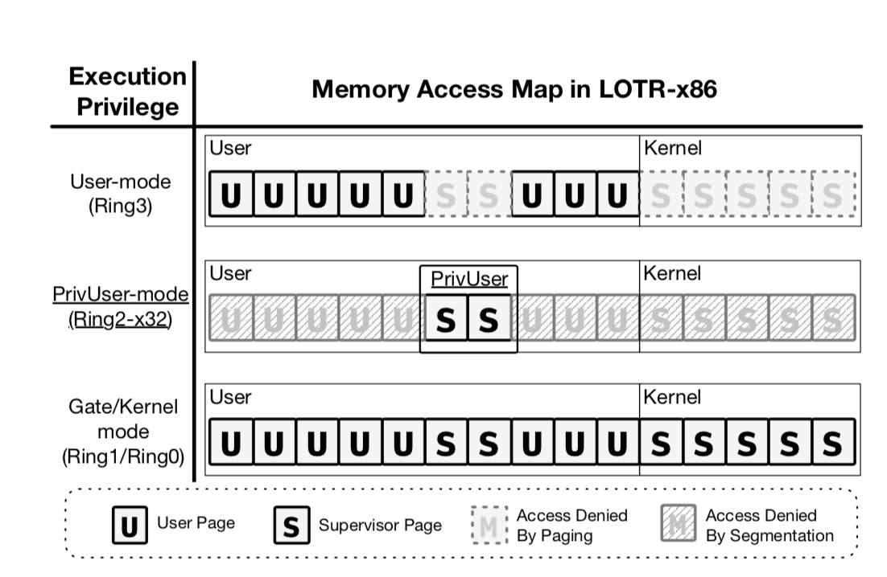
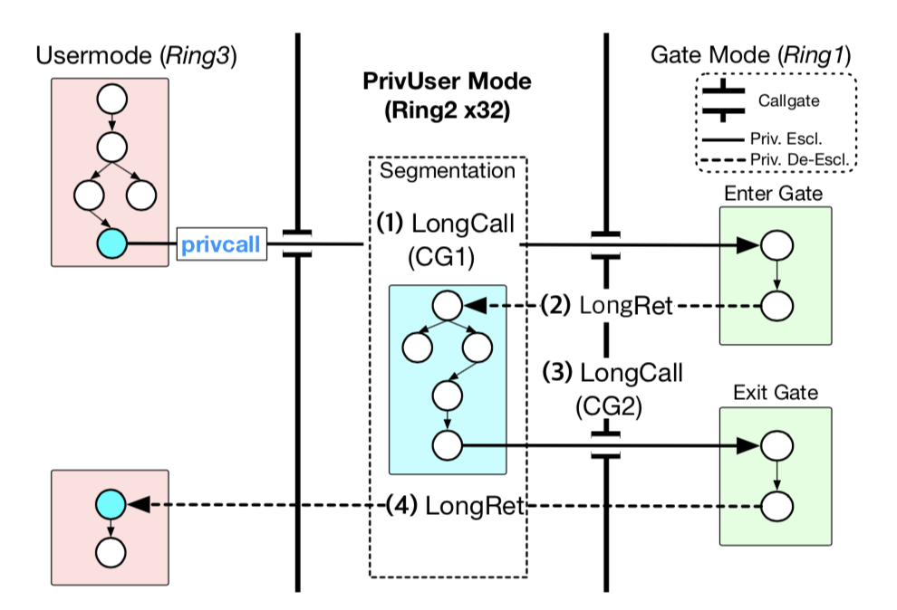
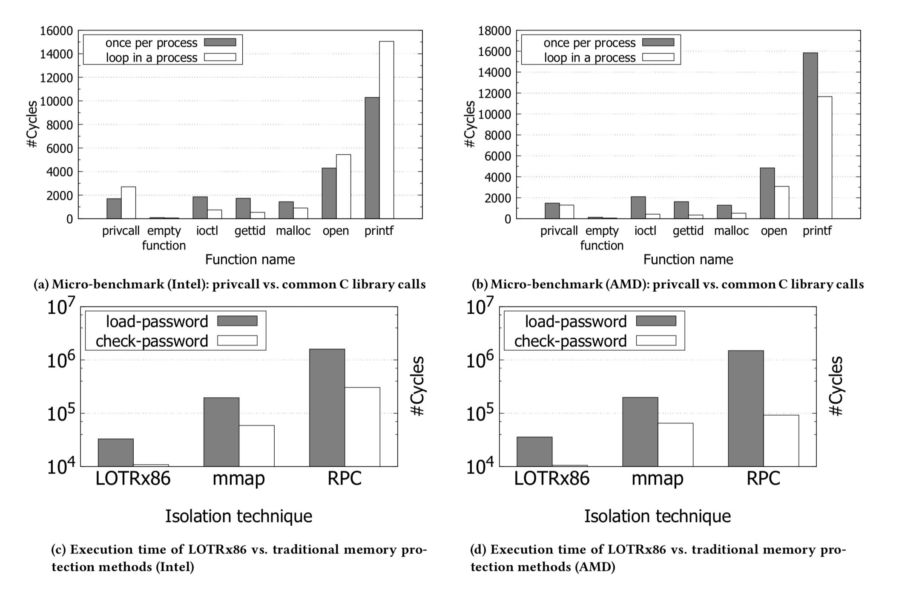

# Lord-of-the-X86-Rings-A-Portable-User-Mode-Privilege-Separation-Architecture-on-X86

# Abstract

前heartbleed漏洞导致的敏感信息常泄露一直是人们要解决的问题，即如何保护程序中的隐私数据不被任意的访问到。研究人员想到的方法根本出发点为，将隐私数据隔离，即使存在程序漏洞，也不能任意访问到这些敏感数据。而将隐私数据存放于什么位置，是人们一直以来需要解决的问题。此前的解决办法包括，线程隔离，进程隔离，使用可以信执行区域(如Intel SGX)等。这些方法或者性能影响比较大，或者受限到CPU型号。***而在这篇论文里作者使用Intel x86处理器一直以来存在的r0-r3四个特权等级来将数据隔离访问，一方面解决了处理器兼容问题(几乎所有Intel AMD处理器均支持这四个特权级别)，一方面解决了性能问题。***

| relevant information |                                                              |
| -------------------- | ------------------------------------------------------------ |
| *作者*               | Hojoon Lee, Chihyun Song, Brent Byunghoon Kang               |
| *单位*               | CISPA Helmholtz Center i.G. GSIS, School of Computing, KAIST |
| *出处*               | ACM CCS'18                                                   |
| *原文地址*           | https://github.com/wtwofire/database/blob/master/papers/reverse/2018-Lord%20of%20the%20X86%20Rings%20A%20Portable%20User%20Mode%20Privilege%20Separation%20Architecture%20on%20X86.pdf |
| *源码地址*           |                                                              |
| *发表时间*           | 2018年                                                       |

# 1. x86 特权级别及切换

这篇论文带读者复习了x86处理器的环(ring)特权等级，门描述，GDT，LDT，段选择子，段间跳转等内容。而这篇论文的内容主要基于现代操作系统几乎没有用到的r1,r2两个特权等级。用户程序运行在R3等级，而操作系统内核运行在R0级别。用户程序不能访问到内核数据空间，原因在于页表的访问权限的限制。以下将内核页面权限简称S页面，将用户页面权限称为U页面。作者将用户的敏感数据及访问这些数据的代码放置于S页面，从而达到普通用户程序无法访问到敏感数据。然后将段代码所运行的特级等级设置于r1，从而阻止代码访问到内核数据。达到双向隔离。即普通程序无法访问到敏感代码数据，敏感代码无法访问到内核数据。

# 2. 权限访问控制

如上图所示，作者将敏感数据代码所在特权等级(r2)称为PrivUser-mode。用户模式由于页面属性的限制不能访问到内核及PrivUser，而作者将R2所在段的段基地地址与段限写在固定的位置，使得PrivUser的代码不能访问到内核。用户可以将特殊的数据如密钥等标记为敏感数据从而存放在PrivUser所在的S页面中。而需要访问到这些敏感数据需要先将处理器提升到R2级别。作者将访问数据的函数同样放到PrivUser所在的内存中，调用这些函数首先需要一个跨段跳转提升处理器级别。然后在R2特权中执行函数。

如上图即为作者的跨段跳转示意图，作者借助r1作为一个跨段跳转板，原因是他将R2段中的L标志(32位兼容模式)置位了，而跨段跳转指令不允许从一个非32位段跳到一个32位段，而允许从一个非32位段返回32位段，因此先进入R1将特权等级提升，再通过段返回指令如(lret)到PrivUser mode。这里我不能理解为何要将PrivUser段设置为32位兼容模式，从而导致多需要R1层作为跨段跳转中转。

# 3. 编译套件

作者将这套系统命名为LOTRx86。其中包含一系列的能够帮助用户编译保护隐私数据的软件。整个编译系统的流程如下图所示

作者定义了一个宏，这个宏接受函数名称和参数类型等作为参数，并对外导出一个调用接口。开发者将访问敏感数据的函数导出，然后在主程序中使用系统所提供的宏来访问这个函数。由于PrivUser层的数据代码是32位兼容的，因此作者直接将这段内容直接链接进可以执行文件中。并且作者修改了libc中的malloc等内存分配函数使得PrivUser中的函数分配的内存始终在PrivUser内存中。其中包含一个内核模块，其功能为初始化LDT，初始化PrivUser内存，写入跨段跳转中转指令等。

# 4. 评估

作者使用Privcall与一些常规的系统调用作对比，并且使用运行多次程序与在一次程序中多次调用来模拟程序使用接口的频繁程度。从图中可以看出Privcall相对于一些常规系统调用所带来的开销并不高。

接下来作者将LOTRx86方法与其他的两种方法作比较，即使页面保护与进程隔离两种方法。可以看出LOTRx86所带来的开销小于另外两个方法。

# 5. 评价

相对于传统的使用进程隔离，页面保护的方法，使用段隔离的方法带的开销的确是比较小的。方法比较新颖。但是除了作者提到的几个缺点：

1. 参数仅支持32位
2. 不支持ASLR
3. 不能与用户程序共享数据空间

我觉得作者的论文来缺乏了一点：没有将所用到的段描述详细的描述出来。

另外我觉得作者的关于对敏感数据的访问定义不够好，我觉得对于敏感数据的访问，不应该以代码段或者说函数来看，而应该以程序运行的时间段来看。即不能说某个函数是可以访问敏感数据的，而应该说在程序运行的某个时间段是可以访问敏感数据的。由于这个定义的不够好，所以我发现作者的设计中的一个缺陷。比如某个访问敏感数据 的函数需要使用libc中的fread函数，那么由于访问控制的原因，那么fread函数同样必须位于PrivUser层，而这样正常的函数需要使用fread的函数又必须将这函数位置PrivUser层中，这样的关联导致大片的函数无法分开。而我提出我的一个想法：

1. 构造一个LDT或者GDT，将段基地址写为0而将段限写为用户空间地址最大值。将这个段特权等级设置为1或者2，对应的SS,CS,DS都设置为使用这个LDT或者GDT。
2. 将敏感数据放置于S页面中，当程序需要访问到敏感数据时，使用一个段跨越跳转跳到这个转中，跳转地址写为下一条指令。那么程序的执行流程正常进行，但是特权等级却切换到了高的特权等级上。
3. 当不再需要访问敏感数据时则伪造一个栈结构，跨段返回到下一条指令，这样程正常继续以低特权运行。

这样做的好处有：

1. 作法简单，只需要定义两个宏用于平衡栈和跨段跳转及返回
2. 由于段空间与用户空间重叠，因此可以直接访问用户空间数据
3. 符合访问敏感数据的定义，即访问敏感数据的代码与正常代码在内存中存在于一块，不需要另外编写一个宏将这段函数放在另外一个地方，只是访问时的特权等级变了。这样我所提到的函数牵连问就不存在。
4. 粒度更加可控，作者提出的粒度基于函数，即将整个函数作为访问敏感数据的代码块，而这里可以选择一小块代码，外包一个跨段宏和退段宏即可。