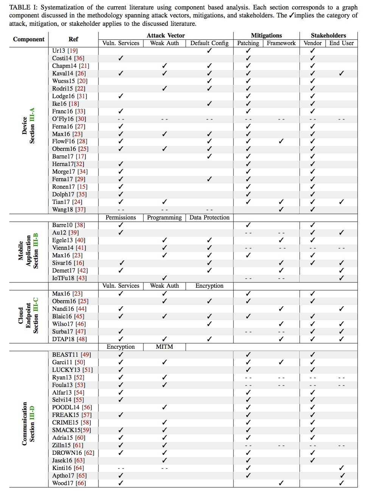
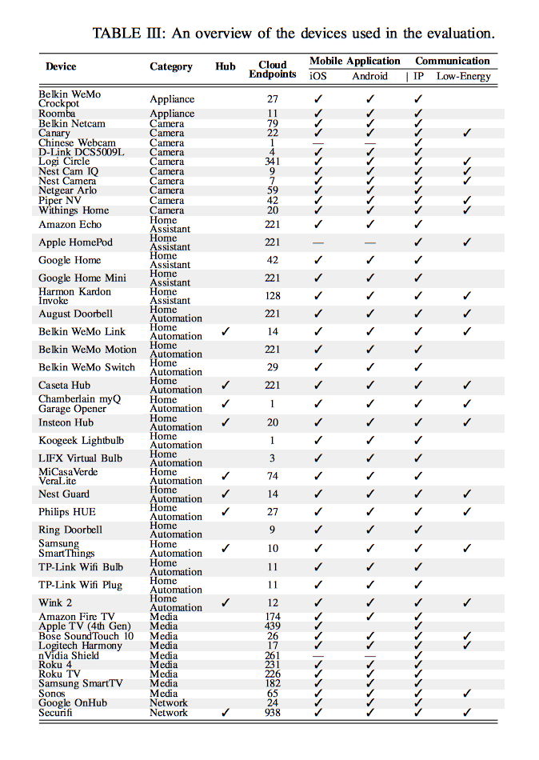
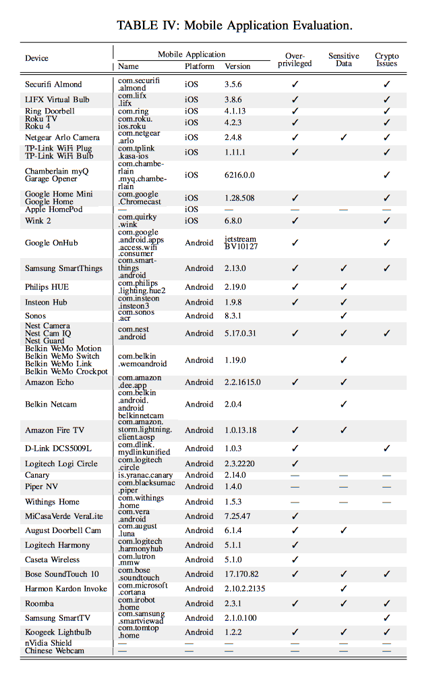
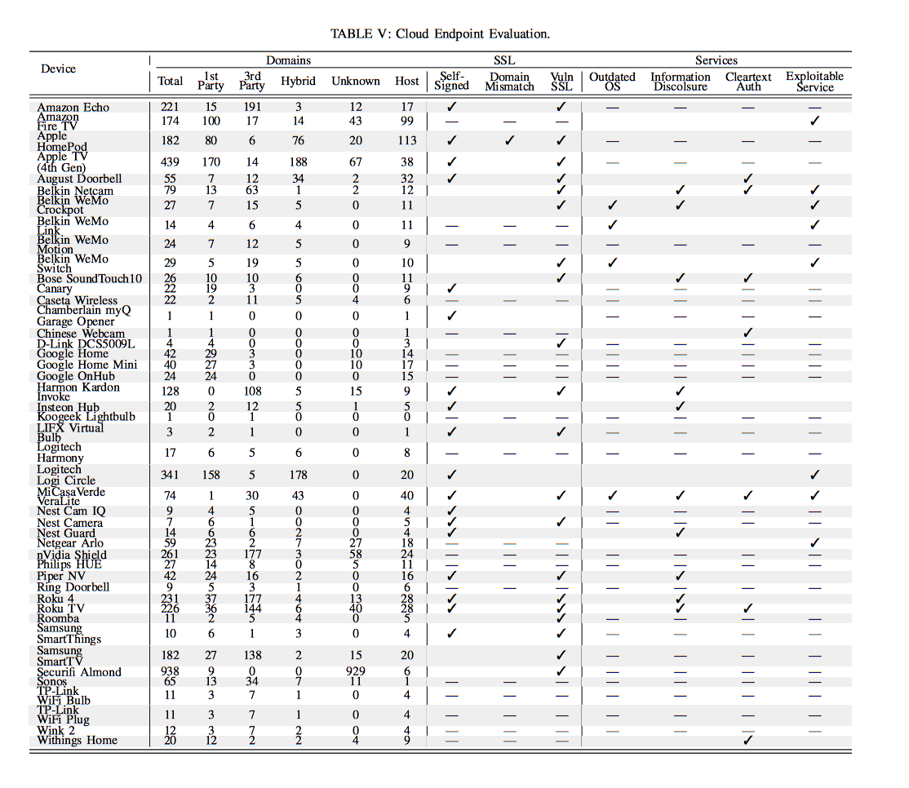
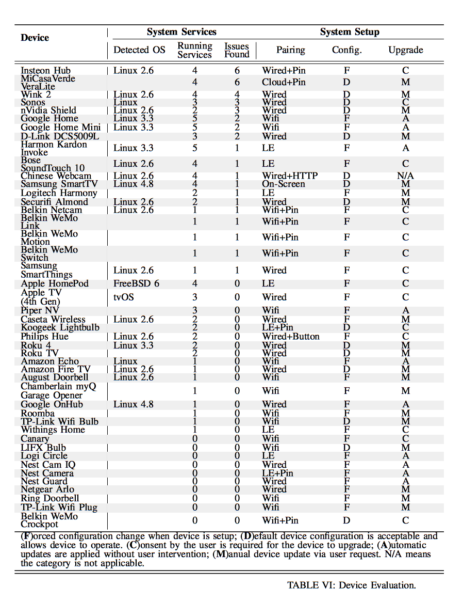
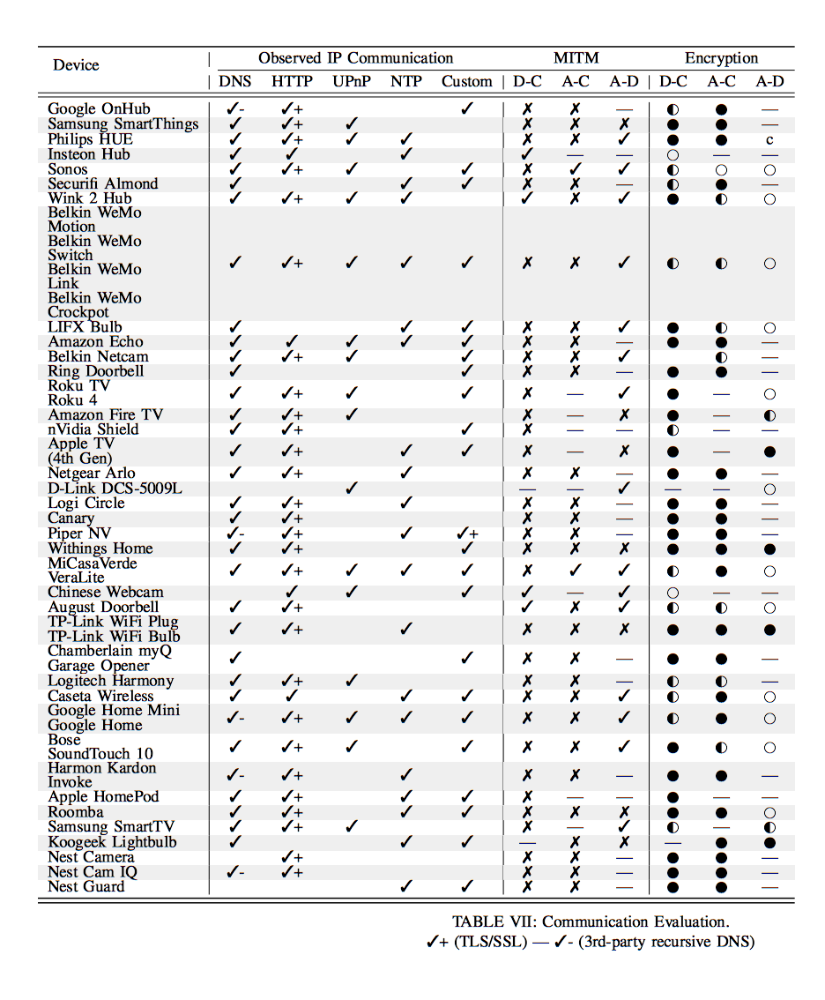

# SoK: Security Evaluation of Home-Based IoT Deployments

# Abstract

智能家居在安全方面一直表现得不尽人意，究其原因，在于IoT系统相对于传统的嵌入式系统，还引入了智能终端和网络，这就导致了其本身暴露了更多的攻击面。本文通过总结大量论文来帮助研究人员和从业者更好的理解针对智能家居的攻击技术，缓解措施，以及利益相关者应该如何解决这些问题。最后作者利用这些方法评估了45款智能家居设备，并将实验数据公布在[https://yourthings.info%E3%80%82](https://yourthings.info./)


| relevant information |                                                              |
| -------------------- | ------------------------------------------------------------ |
| *作者*               | Omar Alrawi、Chaz Lever、Manos Antonakakis、Fabian Monrose†  |
| *单位*               | Georgia Institute of Technology                              |
| *出处*               | S&P'19                                                       |
| *原文地址*           | https://github.com/wtwofire/database/blob/master/papers/IOT/2019-SoK%EF%BC%9ASecurity%20Evaluation%20of%20Home-Based%20IoT%20Deployments.pdf |
| *源码地址*           |                                                              |
| *发表时间*           | 2019年                                                       |

# 1.方法论

## 1.1抽象模型


- V: A(apps)、C(cloud)、D(devices)
- E: communication

## 1.2安全特性

### 1.2.1攻击面

- Device
  - Vulnerable services
  - Weak authentications
  - Default configurations（出厂设置）
- Mobile application (Android, iOS)
  - Permissions: over-privileged
  - Programming: 密码学误用
  - Data protection: API keys, passwords, hard-coded keys
- Communication (local, Internet)
  - Encryption
  - MITM
- Cloud
  - Vulnerable services
  - Weak authentications
  - Encryption

### 1.2.2缓解措施

- patching
- framework: 重构

### 1.2.3利益相关

- vendors
- end-user

其实还可以细分，芯片厂商，物联网平台，经销商，第三方的开发者等，来定义谁来负责解决谁的问题。

## 1.3分类的方法

- Merit: 创新性、有效性
- Scope: 集中在讨论安全性（攻击性和防御性）
- Impact: 影响力
- Disruption: 揭示了一个新的领域

## 1.4威胁模型

只考虑Internet protocol network attacker，不考虑low-energy based devices，作者认为攻击所需要的资源在大多数家庭都没有。同时如果能hacking hub devices，就默认exploit了所有的low-energy based devices。（这里就限制了讨论的范围）

# 2.相关的研究



## 2.1Device

1. Attack Vectors 设备上暴露的引脚可以让攻击者轻而易举的获得权限，不安全的配置会加剧漏洞的产生， 而缺少或弱的身份认证是最容易出现的问题，这些都导致设备上的安全问题被频繁曝出。
   - August Smart Lock，硬编码的密钥、debug接口
   - cloud-based cameras，强口令但是是mac地址的base64编码
   - Sonos device，在高端口开了后门服务，并且没有认证
   - 厂商集成第三方库的安全使得其很难保证整体的安全性
   - Philips Hue device，通过侧信道攻击得到master key，配合协议的漏洞完成蠕虫
2. Mitigations 要想解决以上问题，就要求vendor通过设备更新来打patch，要求security by design。
   - Fear and logging in the internet of things
   - SmartAuth，识别IoT应用的权限，这个主要是针对SmartThings和Apple Home
   - FlowFence，把应用分成sensitive和non-sensitive两部分，这部分需要开发者来做。
3. Stakeholders Vendors有责任patch和update有漏洞的设备，但也要授权给end-user一定的权限，比如可以关闭某些有问题的服务。
   - SmartAuth提供一种可以导出认证规则的方式，但只能vendor来做。
   - Sonos device允许用户使用网络隔离的方式来缓解漏洞。

## 2.2Mobile Application

1. Attack Vectors over-privileges、programming error、hard-coded sensitive information
   - August Smart Lock，作者用敏感信息dump密钥
   - IoTFuzzer，利用app来对设备做fuzzing，当然也可以利用app做攻击
   - 用app来收集设备的有关信息，然后重新配置路由器的防火墙，使得设备处于公网
   - Hanguard，app宽松的安全假设导致设备的隐私泄露（App作为设备的入口，厂商往往默认App所处的网络是可信的）
2. Mitigations
   - 基于角色的访问控制
3. Stakeholders mobile的安全依赖user和vendor，user往往有权限控制的权利，同时user应该遵守从app store上下载app。vendor应该解决programming error并且安全存储数据。

## 2.3Cloud Endpoint

1. Attack Vectors
   - August Smart Lock，cloud端实现的不安全的API导致越权
   - cloud没有对固件的更新包签名
   - web的xss漏洞，username枚举。。
   - AutoForge，伪造app的请求，实现爆破密码，token劫持等
2. Mitigations
   - 身份认证
   - 细粒度的访问控制
3. Stakeholders 由于云平台一般只有厂商管理，所以cloud上的基础设施和API实现的安全应该由他们来负责。

## 2.4Communication

classes of protocols * Internet protocol * low-energy protocol

```
Zigbee
Z-Wave
luetooth-LE
```


Application layer protocols，DNS、HTTP、UPnP、NTP

1. Attack Vectors

   - EDNS解析 导致信息泄露

   - 用NTP的MITM攻击绕过HSTS

   - UPnP实现时缺少认证，内存破坏漏洞等问题

   - TLS/SSL， TLS 1.0的IV问题，TLS RC4的问题

   - BLE、Zigbee、Z-Wave，协议设计本身的问题

   - LE的重放攻击更容易

2. Mitigations 

   - 对于HTTP，UPnP，DNS和NTP协议，放弃使用不安全的协议，使用最新的协议。
   -  为有实现缺陷的TLS/SSL，升级服务器端和客户端库到最新版本应解决漏洞。
   - 对于基于LE的通信，第一代Zigbee和Z-Wave协议有严重的缺陷，并且缓解方案有限。供应商可以禁用这些协议。
   - 最近也有研究者发现通过监控物联网设备的流量，可以侧信道出一些隐私数据。 Apthorpe 等设计了如何在家中构造流量网络来防止旁道攻击。

3. Stakeholders 

   - 互联网服务提供商（ISP）可以看到基于IP的协议的数据包，但它们不是负任何缓解。 对于ISP来说，他们必须提供其相应的义务（这个我理解是比如说Mira DDoS，ISP虽然不能阻止设备发出去的恶意流量，但是他可以ban掉设备访问C&C域名）。
   - 对于LE协议，供应商可以缓解禁用易受攻击的设备的配对。

# 3.评估

作者对45款比较流行的不同的设备进行了各方面的评估。这些设备主要包括

- appliances
- cameras
- home assistants
- home automation
- media
- network devices

实验配置的网络环境，包含一个linux machine用于监听所有的流量和一个路由器（包含Wi-Fi热点）。对流量抓包后分析，对device和cloud使用漏扫分析，对app使用自动化审计工具。这里存在几个难点，

- 设备自动更新 – 手动关掉
- 云平台的分类 – 人工识别，排除CDN
- 无线流量分析 – Wireless to wireless，
- iOS应用解密 – 砸壳
- …
- 



MobSF(Mobile Security Framework）、Qark，Kryptowire这些针对app的漏洞扫描器。45个设备有42个有app，其中包含41个Android平台，42个iOS平台。24个Over-privileged。15个包含硬编码的API key。17个使用了硬编码的key和IV。 



Nessus Scanner扫描。45个设备4000个域名。这些域名包括 基于云的服务（950）， 第三方的服务。CDN（1287） 混合，使用了AWS，Azure的服务的厂商（630） ，未知（1288）。



Nessus Scanner扫描，分析设备的操作系统，服务，漏洞等。在45个设备中发现了84个服务，39个有issue。这些服务主要是SSH，UPnP，HTTP，DNS，Telnet，RTSP。这些issues包括

- 错误配置的TLS/SSL, 比如自签名的证书、过期的证书、短的密钥。
- UPnp未授权访问。



Nessus Monitor，ntop-ng，Wireshark，sslsplit。用sslsplit做MITM。43个D-C，35个A-C，27个A-D（LAN）。IP 通信包括DNS（41）、HTTP（38）、UPnP（21）和私有的协议（5）。

MITM: D-C(4), A-C(2), A-D(20) Encryption: D-C(40), A-C(24), A-D(7) 



缓解措施

- Device 通过安全信道更新并确保更新内容的完整性。设备在激活前可以检查配置是否正确并安全。设备应该保证只与验证过身份的设备交互。
- Mobile 敏感信息，比如API key应该在安装的时候导出并秘密存起来。密码算法应该尽量使用成熟的第三方库实现。
- Cloud 厂商应该尽量使用商业化的云平台。通过API管理endpoint的配置。不应该再支持不安全的协议。
- Communication 验证endpoint的身份，防止中间人攻击。保护通信协议的完整性。

​                                                                                                                                                               ***转载于GoSSIP***