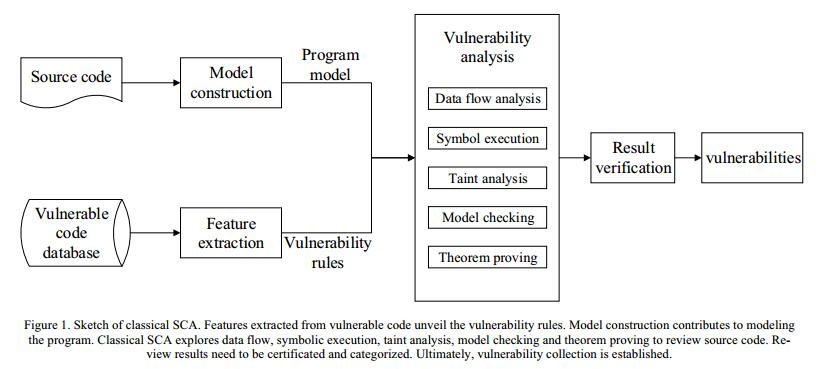
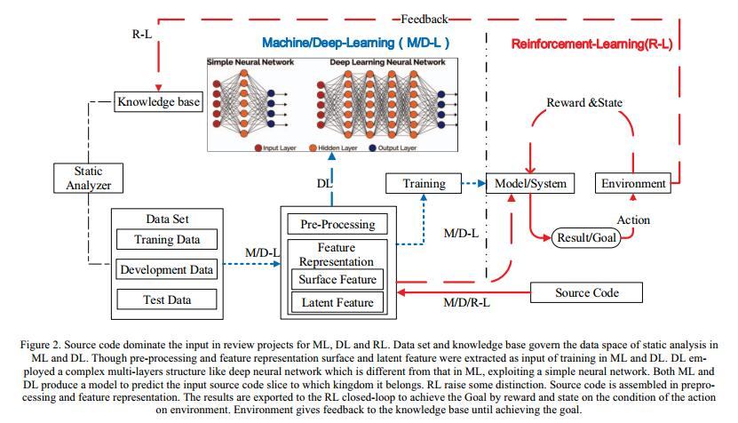

# A Survey on Source Code Review Using Machine Learning

# Abstract

源代码审查充分限制了软件系统的安全性。可伸缩性和精度对于代码审查工具的部署非常重要。但是，传统工具只能通过繁琐的大规模源代码审查来自动检测一些高误报和漏报的安全漏洞。各种脆弱点和漏洞在源代码中显示出特定的特征。机器学习系统建立了源代码的特征矩阵作为输入，包括变量，函数和文件，通过区分或生成方法生成ad-hoc标签，以自动和智能地查看源代码。无论编程语言如何，源代码本质上都是文本信息。安全和易受攻击的函数都可以从源代码凸出。幸运的是，已经开发了各种机器学习方法来学习和检测智能源代码安全审查中的脆弱点和漏洞。代码语义和句法特征的组合有助于在源代码审查期间对假阳性和假阴性的优化。在本文中，我们使用机器学习方法对与智能源代码安全性审查相关的文献进行了回顾。它说明了在源代码安全审查中接近ML的主要证据。我们相信机器学习及其分支机构将在源代码审查中脱颖而出。

| relevant information |                                                              |
| -------------------- | ------------------------------------------------------------ |
| *作者*               | Wang Xiaomeng, Zhang Tao, Xin Wei,Hou Changyu                |
| *单位*               | China Information Technology Security Evaluation Center Beijing, China;China anhua technology Limited company Beijing, China |
| *出处*               | 2018 3rd International Conference on Information Systems Engineering |
| *原文地址*           | <https://ieeexplore.ieee.org/document/8614720>               |
| *源码地址*           |                                                              |
| *发表时间*           | 2018年                                                       |

# I. 介绍

​		本文介绍了机器学习（ML）在源代码审查中文献综述的研究成果。代码审查目标是发现错误，安全漏洞和违反程序规范。代码错误，弱点或漏洞在软件中很普遍，并且可能导致各种安全问题，包括死锁，信息泄露或系统崩溃，更严重的是，一些黑客攻击[1]。WannaCry勒索软件攻击是2017年5月WannaCry勒索软件发起的全球网络攻击[2]。该攻击于2017年5月12日星期五开始[3] [4]，据报道，在一天之内，已有150多个国家的230,000多台计算机受到感染。 [5] [6]英国国家健康服务（NHS）的部分地区受到感染，导致其在袭击期间仅在紧急情况下运行一些服务，西班牙的TelefónicaFedEx和Deutsche Bahn以及许多其他世界各国和公司[7]。中国的一些Windows操作系统已经被感染，而校园网用户已经是第一个遭受严重破坏的用户。大量的实验室数据和毕业设计已被锁定。一些大型企业的应用系统和数据库文件在加密后无法正常运行。这些袭击威胁到企业，政府和消费者，随着黑客犯罪对全球经济的年度成本增加，费率和成本也在增加。2017年，估计全球安全市场将超过1200亿[1]。因此，检测到更早的漏洞或错误，软件系统将更好。作为软件安全保护最重要的部分之一，源代码审查已经服务了数十年，并且已经通过ML和数据挖掘将更多智能方法植入到挖掘代码漏洞中。

​		在过去的十年中，ML在代码审查中得以蓬勃发展[8] [9] [10] [11]。本文描述和讨论了ML算法和应用的最新技术。机器学习已经在源代码安全任务中得到应用，例如代码推荐，源代码错误检测和代码检索。传统的机器学习系统利用手动特征工程来进行代码错误检测，这是标签只能临时的用于特定项目。随着机器学习的核心扩展，深度学习方法能够通过很少的手动操作捕获复杂的自下而上功能。深度学习可以智能地提取错误的代码特征，将程序特征与查询的特征匹配，并预测下一个可能代码的概率[1]。源代码最终是文本信息，主要涉及深度学习中的自然语言（NLP）研究。不幸的是，考虑到编程语言和自然语言之间的结构差异，现有的NLP算法对于代码表示是不合适的。为了提取适用的特征表示，需要整理现有方案和改进策略的缺陷[12]。

​		在本文中，我们从以下几个方面对源代码审查进行了详尽的概述：第二节简要介绍了经典的源代码分析(SCA)，包括典型的验证方法和进程流程。第三节说明了现有的机器学习SCA方法，如传统的机器学习方法和深度学习应用在源代码审查中。第四部分总结了整篇论文的一些结论，说明了存在的问题，并展示了一些未来的工作，并承认了本文的贡献者。

# II 经典的静态代码分析

​		静态代码分析（SCA）通常作为代码审查的一部分执行，并在安全开发生命周期（SDL）的实施阶段执行。 SCA的程序。 SCA通常是指通过使用数据流分析，污点分析，符号执行等技术的工具来试图发现“静态”（非运行）源代码中可能存在的漏洞。
​		假阳性和假阴性揭示了SCA的局限性。在分析与闭源组件或外部系统交互的应用程序时，可能会报告误报结果，因为如果没有源代码，则无法跟踪外部系统中的数据流，从而确保数据的完整性和安全性。静态代码分析工具的使用也可能由于工具不会报告漏洞导致漏报。如果在外部组件中发现新漏洞，或者分析工具不了解运行时环境以及是否已安全配置，则可能会发生这种情况。
​		以前的工作已经证明，经典SCA能够预测源代码漏洞，尽管有时会出现不可接受的误报和漏报。最近，人工智能，尤其是机器学习及其相关分支，对SCA的学术对话产生了重大影响，下一部分将对此进行研究。

图1.经典SCA的草图。从易受攻击的代码中提取的功能揭示了漏洞规则。模型构建有助于对程序进行建模。经典SCA探索数据流，符号执行，污点分析，模型检查和定理证明来审查源代码。审核结果需要通过认证和分类。最终，建立了漏洞收集。

# III 机器学习SCA

​		在过去十年中，ML在基于特征表示的智能代码审查中蓬勃发展。 ML任务可以分为传统的机器学习，深度学习和强化学习，如图2所示。传统的机器学习包括监督学习和无监督学习。对于监督学习，计算机将显示示例输入及其所需标签，目标是学习将输入映射到输出的一般规则或功能。然而，对于无监督学习，没有给学习算法赋予标签，使其自己在其输入中找到结构。无监督学习可以是特征学习过程。

​		深度学习使用多层非线性处理单元级联进行特征提取和转换[13]。每个连续层使用前一层的输出作为输入，以有监督和/或无监督的方式学习，学习对应于不同抽象级别的多个级别的表示，并利用某种形式的梯度下降通过反向传播进行训练[14] 。它们还可以包括在深度生成模型中逐层组织的潜在变量，例如Deep Belief Networks  和Deep Boltzmann Machines 中的节点。相比之下，强化学习似乎更加智能，计算机程序与必须执行某个目标的动态环境相互作用。该程序在奖励和惩罚方面提供反馈，因为它在问题空间中导航。这些输入来自在线或离线源代码存档。

图2.源代码在ML，DL和RL的审查项目中占主导地位。数据集和知识库管理ML和DL中静态分析的数据空间。虽然提取预处理和特征表示表面和潜在特征作为ML和DL训练的输入。 DL采用复杂的多层结构，如深度神经网络，与ML中的不同，利用简单的神经网络。 ML和DL都生成一个模型来预测它所属的输入源代码片。 RL提出了一些区别。源代码在预处理和特征表示中组装。结果输出到RL闭环，通过奖励和状态在环境行动的条件下实现目标。环境向知识库提供反馈，直到实现目标

## A.传统机器学习SCA

​		Internet上有各种源代码存档。这些档案通常由应用程序类别和各种编程语言组成。但是，手动组织源代码存储库并不是一件容易的事，因为它们会迅速增长到非常大的规模。用于归档源代码自动分类的机器学习方法被演示为11个应用主题和10种编程语言。对于局部分类，近年来来自Ibiblio和Sourceforge档案的C和C ++程序主导了研究。支持向量机（SVM）分类器在给定编程语言或特定类别的程序的示例上进行训练。源代码可以准确地自动分类为主题类别，并且可以被识别为特定的编程语言。群集假设和信息理论的基本假设被用来发现软件系统中语义连贯的主题[15]。生成主题的有用性通过人工判断凭经验验证。此外，一个案例研究表明，报告了在分析代码演变时所提出的方法的操作。与传统的主题建模技术相比，这种提出的方法产生了稳定，可解释和更具表现力的主题，而无需进行广泛的参数校准。仍然缺少在有限时间预算内进行OS规模计划评估的方法。 [3] **VDiscovery**，收集了轻量级的静态和动态功能，以预测测试用例是否可能包含ML上的软件漏洞。在静态级别，比较程序切片之间的相似性可能是个好主意。智能手机用户面临着一个安全困境：他们安装的许多应用程序都依赖于隐私敏感的数据，尽管它们可能来自可靠性难以判断的开发人员。研究人员已经使用越来越复杂的静态和动态分析工具解决了这个问题，以帮助评估应用程序如何使用私有用户数据[16]。**SUSI**提出一种新颖的机器学习指导方法，用于直接从任何Android API的代码中识别源和目的。给定一组手工注释的源和接收器，SUSI识别整个API中的其他源和接收器。为了提供更细粒度的信息，SUSI进一步对源和目的[17]进行了分类。输入验证不充分导致许多漏洞，因此省略或缺少检查可以找到发现安全漏洞的宝贵线索。 **Chucky**能够实时准确地识别丢失的校验，最终使我们能够发现其中两个项目中12个以前未知的漏洞[18]。由于算法密集型特性或对潜在大规模数据的应用，机器学习系统是独特的，因此值得特别考虑。进行实证研究以分析机器学习系统中的错误并报告错误类别与错误严重性之间的关系[19]。

## B. 深度学习SCA

​		最近，深度学习极大地影响了SCA的审查。卷积神经网络（CNN）已经在处理各种NLP任务中获得了普及。特别是对于文本分类，深度学习模型取得了显着成果[1] [16] [18] [20]。所提出的模型使用字嵌入层，接着是具有多个滤波器的卷积层，最大池化层，最后是softmax层。采用非静态和随机初始化的嵌入层，因此从头开始训练载体。最常见的ML任务依赖于代表代码特征的手动特征设计。不幸的是，所有这些都在检索源代码的语义和句法解释方面遇到了挑战，这是构建准确预测模型的重要能力[1]。卷积网络能够进行恶意软件分类和分析。实现了由卷积和前馈神经构造组成的神经网络。该体系结构体现了一种分层特征提取方法，该方法将n-gram指令的卷积与从可移植可执行文件（PE）的头部派生的特征的简单矢量化相结合。评估结果表明，我们的方法优于基线方法，例如简单的前馈神经网络和支持向量机，因为它在精度和召回率方面达到了93％，即使在数据混淆的情况下也是如此[20]。

​		一种新兴的方法是将软件代码视为一种文本形式，并利用（NLP）技术自动提取特征。以前的工作使用BOW将源代码文件表示为与频率相关的代码令牌的集合。这些术语是用作其脆弱性预测模型的预测变量的特征。

​		经典NLP技术与深度学习结合使用被用于检测、分类非NLP应用和报告与人为约束语言（如编程语言及其编译对应语言）中发现的漏洞或不良编码实践相关的弱点[21]。在我们的结果中将NLP方法与信号处理方法进行比较和对比。它显示了用C，C ++和JAVA编写的开源软件的特定测试用例的有希望的结果。

​		源代码实际上是文本信息。机器学习中深度学习模型的最新进展为软件度量和BOW代表软件代码提供了强有力的替代方案。最广泛使用的深度学习模型之一是长期短期记忆（LSTM）[22]，这是一种特殊的递归神经网络，在学习文本和语音等顺序数据中的长期依赖性方面非常有效。 LSTM在许多应用中表现出突破性的性能，例如机器翻译，视频分析和速度识别[1]。一些研究人员提出了一种新颖的基于深度学习的方法来自动学习用于预测软件代码中的漏洞的功能，利用LSTM捕获源代码中的长的上下文关系，其中相关的代码元素分散得很远。建立了强大的深度长期短期记忆（LSTM）模型，以同步自动学习代码的语义和句法特征。同时，RNN编码器 - 解码器用于为给定的API相关自然语言查询生成API使用序列[23]。它可能涉及其他软件工程问题，如代码搜索和错误本地化。代码克隆检测也是软件维护和SCA的一个重要问题[24]。所提出的代码分析工具利用深度学习的优势，并自动将词汇层面挖掘的模式与句法层面挖掘的模式联系起来。

# IV 结论和未来工作

本文代表了源代码审查中机器学习（ML）文献综述的研究成果。 ML和一些分支提出了一些新的想法来实现分类器，回归和代理来预测源代码漏洞，具有较低的误报和漏报。幸运的是，深度处理安全网络以随着数据量的增加自动调整和调整连接的能力将改善学习过程。特别是，这将允许我们自动化和使用网络专门从事某些领域。通过深入学习，安全系统可以通过尝试数十亿种组合并进行数百万次观察来自动学习。针对特定类别的问题，这是非常有希望的，但它不是一个灵丹妙药。仅仅因为一项技术使用深度学习并不意味着其他传统的AI和机器学习方法并不具有更高的价值或实用性。人工智能是一种多用途技术，我们可以在安全和其他行业中工作，学习，迭代和改进。不幸的是，没有找到通过强化学习来审查源代码的论文。主要原因是在审查过程中没有建立动态交互，但是，提出了将静态和动态方法结合起来测量源代码的有希望的方法。

最重要的是，漏洞数据规模不足仍然是一个挑战。跨文件，跨版本和跨项目需要占主导地位，因为对象大多不存在于训练集中。 ML，DL和RL的评论在源代码分析研究中一直走在前列。

# 个人观点

关于源代码漏洞发现总结的较少，所列举文献大多为关于机器学习和深度学习。