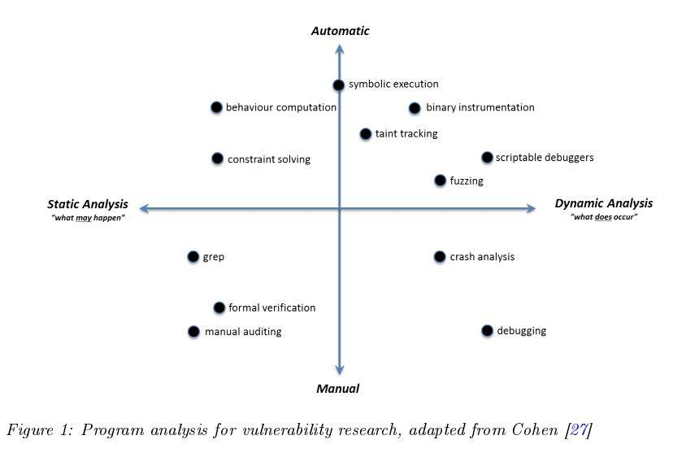

#  A Review of Machine Learning in Software Vulnerability Research

# Abstract

搜索和识别计算机软件中的漏洞具有悠久而丰富的历史，可用于预防或恶意目的。在本文中，我们研究了机器学习（ML）技术在软件漏洞研究（SVR）中的应用，讨论了以前和当前的工作，以说明学术界和工业界如何利用ML。我们发现，主要关注的不仅仅是发现新方法，而是通过简化和自动化流程来帮助SVR从业者。考虑到已经证明的各种应用，我们相信ML将在未来继续为SVR提供帮助，因为探索了新的使用领域，并且可以使用改进的算法来增强现有功能。

| relevant information |                                                              |
| -------------------- | ------------------------------------------------------------ |
| *作者*               | Tamas Abraham  and Olivier de Vel                            |
| *单位*               | Cyber and Electronic Warfare Division  Principal Scientist Defence Science and Technology Group |
| *出处*               | Cyber and Electronic Warfare Division                        |
| *原文地址*           | <https://www.dst.defence.gov.au/sites/default/files/publications/documents/DST-Group-GD-0979.pdf> |
| *源码地址*           |                                                              |
| *发表时间*           | 2017年                                                       |

# 1. 简介

创建计算机软件是一个非常重要的复杂过程，通常会产生包含一些缺陷和脆弱点的代码。大型代码库的验证可能很困难，或者有时由于成本而被忽略，导致操作系统由于它们表现出来的意外和不良行为而可能崩溃或被操纵。虽然软件安全性错误的严重程度是可变的，但有些可能会非常严重，以至于被利用导致生产力损失，知识产权损失甚至物理损坏来对用户造成严重伤害。 Dowd等人[30]将术语软件错误中能被用于恶意目的的子类称为漏洞， 虽然在特定环境中实际利用漏洞可能并非总是可能，或者也不适合攻击者的目标。解决易受攻击软件引起的问题的方法已经在软件漏洞研究（SVR）中创建了研究。
对影响计算机系统的漏洞的研究不仅限于软件。但是，我们在本文中的重点是基于软件的漏洞，我们不考虑硬件或系统架构。软件本身可以作为源代码或二进制文件进行分析，提供多种途径来发现漏洞。软件漏洞的研究过程可以定期分为发现，分析和利用的过程，并将缓解作为预防活动[73]。每个阶段探讨了处理漏洞的不同方面，通常需要代码审计员等从业者的长期和费力的投入。自动化在许多SVR活动中起着重要作用，然而目前通过人工解释发现了大多数漏洞。越来越多的机器学习（ML）技术被整合到SVR过程中，以进一步减少对手动交互的需求。成功应用后，ML算法可以引导用户找到最可能的解决方案，并可能发现以前未知的漏洞。本文的目的是对利用机器学习的SVR内部的目录进行编目，以突出当前事业的状态，并确定可能在未来做出进一步贡献的可能领域。

# 2. 背景

本文的重点是机器学习在软件漏洞研究中的应用。为了进行讨论，我们分别介绍了两个领域和一些一般细节。在审查各个出版物时，后续章节将根据需要提供进一步的详情。接下来是对这两个研究领域的简单概述，在这个阶段，没有强调它们之间的任何联系。

## 2.1 软件漏洞研究

对软件漏洞进行分类不是一项简单的任务。特定漏洞所属的类别通常在分析软件错误期间显示。有时，在漏洞发现过程中可以预期某种类型，因为某些技术隐含地针对有限范围的漏洞类型。**扫描程序**等工具会查找错误的结构，例如过时的库函数以及代码中的其他与安全相关的错误。**模糊测试**是为软件可执行文件提供异常输入以引起意外行为（如崩溃或内存泄漏）的过程，然后可以在相应的源代码中进行调查。全面的**手动代码审查**也可用于发现错误，但它们可能是其他漏洞发现方法的昂贵替代方案。**格式校验**提供了正确性的数学证明，如果不成功，则可以指出问题。然而，由于复杂性和成本，它通常限于小代码段或算法。**符号执行**是一种分析通过程序分支遍历变量值（输入）的技术，是另一种发现方法，尽管它可能遭受诸如路径爆炸之类的扩展问题。

源代码中的一些错误可能很容易组合，尽管某些漏洞仅与其他因素（例如它们部署在其上的平台）结合使用，因此可能难以进行初始分类。计算机体系结构，操作系统，计算机语言的多样性以及语言特定错误的存在使分析更加复杂化。我们使用Dowd等人的书中给出的分类法 [30]作为定义软件漏洞类型的指南。语言特定问题包括：

- 内存损坏，例如缓冲区（堆栈，off-by-one，堆，全局和静态数据）

- 算术边界条件（如数字上溢和下溢）

- 类型转换错误（有符号/无符号，符号扩展，截断，比较）

- 操作符误用（sizeof（），移位，模数，除法）

- 指针算术错误
- 其他错误（评估顺序逻辑，结构填充，优先级，宏/预处理器，拼写错误）

其他漏洞更复杂。问题类别包括实际应用程序中存在的问题类别，例如与操作系统或应用程序平台相关的问题类别，即使基础问题可能由更简单的错误（如内存损坏或指针错误）引起：

- 字符串和元字符漏洞

- 特定于操作系统的漏洞（特权问题，文件权限问题，竞争条件，进程，IPC，线程，环境和信令问题）

- 平台漏洞（SQL注入，跨站点脚本（XSS） ），跨站点请求伪造（CSRF），文件包含和访问，shell调用，配置，访问控制和授权？aws）

对漏洞进行分类的另一种方法是从攻击角度出发。例如，Open Web Application Security Project [3]提供了一个攻击类型列表，并定期编译一系列顶级当代漏洞[1]，并非所有漏洞都与源代码或二进制文件有关。在那些注入攻击（代码，SQL，HTML脚本，远程文件和shell）和控制流劫持，如溢出（buffer，整数，字符串格式）和堆喷射类似于我们上面列出的那些。像Bletsch这样的其他作者提供类似的分类，讨论如何通过代码重用（面向返回的编程（ROP），返回到libc（RILC），面向跳转的编程（JOP））来利用漏洞[80]。 。

随着软件中的漏洞被发现，它们通常与更广泛的社区共享。The Common Vulnerabilities and Exposures  （CVE）是一个公知的信息安全漏洞和风险的库 [4]，目前由MITRE组织维护。漏洞通常附加一个分数来描述其严重性，通用漏洞评分系统（CVSS）[40]是最常用的评分标准之一。提供对CVE，分数和其他相关信息的访问的服务包括诸如开源漏洞数据库（OSVDB）和美国国家漏洞数据库（NVD）之类的数据库。和允许对新发现的漏洞进行实时更新的API（如VulnDB和vFeed）。根据不同类别中发现的漏洞数量，每年都会根据流行漏洞编制统计数据，尽管每种类型的攻击频率和严重程度之间可能没有相关性。例如，Price和Kouns [46]列出了跨站点脚本，SQL注入，跨站点请求伪造，文件包含，拒绝服务和过度攻击，这是2014年根据OSVDB最常见的滥用行为。

减轻软件漏洞影响的方法也产生了各种策略和解决方案。尽管可能无法实现完全错误预防，但软件生产商仍希望尽量减少其产品包含漏洞的可能性。这些包括在开发周期中的全面测试和修复错误，在软件发布后提供数据，以及在安全编程语言中编写代码。在Vanegue [82]中列出了在软件发布之前可以使用的漏洞发现技术列表，例如软件测试，模糊测试和程序验证（定理证明，抽象解释，模型检查）。使用抽象语法树（AST），控制流图（CFG），程序依赖图（PDG）和代码属性图（CPG）等图形建模代码执行可以帮助识别开发过程中的问题。 OS和硬件制造商也提供了软件发布后使用的其他缓解技术。数据执行保护（DEP）/不执行（NX），地址空间布局随机化（ASLR），指令集随机化（ISR），运行时检查（金丝雀，LibSafe），程序引导，控制流完整性（CFI），数据流完整性（DFI）和控制流锁定是当前使用的一些技术，参见[80]。用于执行各种发现任务的软件工具随时可用，包括商业和开源[87]。

程序分析是分析软件行为问题的核心。从理论上讲，软件错误的识别是不可判定的，即在一般情况下不可能编写程序来表示和计算另一个程序的所有可能的执行[67]。在实践中，某些程序行为可能会被忽略，因为它们与当前分析无关。然而，这可能导致在近似下 - 排除可能有效的行为，并且过度近似--包含可能但无效的行为--增加复杂性和资源需求。图1将一些程序分析技术组织到一个图表中，突出显示了各个方法的样式和自动化级别。静态分析在不执行程序的情况下进行，可以提供良好的代码覆盖率和所有可能执行的原因，但无法分析可执行环境，例如操作系统和硬件。另一方面，动态分析是在程序执行期间进行的，或者通过检测程序来分析行为。但是，它只能推断观察到的执行路径而不是所有可能的程序路径。

## 2.2 机器学习

在本节中，我们简要概述了机器学习概念，并重点介绍了我们在本文后面讨论的出版物中遇到的一些相关技术。
存在许多不同的分类法用于分类ML技术。为方便起见，我们使用Barber [13]的书作为本节的参考源，除非给出了具体的参考。

机器学习领域关注数据的自动化探索，产生可用于预测的描述性模型。通常，认识到两种主要的学习方式：**监督学习**从标记数据源构建其模型并关注预测的准确性，而**无监督学习**则集中于从未标记数据提供紧凑描述。除了这两种主要风格外，还可以观察到几种变化。**异常检测**会查找与建模模型不同的数据中的异常值。随着新数据的出现，**在线学习**能够不断更新模型。**主动学习**可以通过要求来自当前模型无法有效描述的环境区域的更多数据来构建更好的模型。**强化学习**能够以反复试验的方式与环境互动，以创建根据某种形式的奖励进行优化的模型。最后，**半监督学习**利用标记和未标记的数据，使用一种类型的数据来改进可以仅从其他类型的数据创建的模型。

多年来，在上述学习方式中已经提出并开发了大量算法。监督学习主要使用多种类型的分类器中的一种来预测数据点所属的组（类）。这是一种离散学习形式，因为输出仅限于一组值。当结果需要在一个值范围内时（即它是一个连续变量），回归就是使用的技术。最简单的分类算法之一是K-最近邻（kNN）算法，它通过查看其K个最近邻居的标签并选择最常见的邻居来确定数据点的类标签，例如基于实例学习使用数据集中的示例而不是使用从中构建的模型来决定类的决策。 NaïveBayes分类器是一种概率算法，它假设描述数据的变量之间具有条件独立性，以简化生成模型的构建。点的类标签是通过使用贝叶斯规则给出不同标签的数据的概率及其条件概率来估计的。其他分类技术对数据进行线性模型，并根据与已知示例计算的决策边界相对应的数据点的位置确定类成员资格。逻辑回归是一种分类算法，它使用最大似然函数来近似属于类的数据点的概率。线性支持向量机（SVM）产生超平面以分离类，使得平面每侧上的最近点之间的距离最大化。

决策树分类器将顺序决策过程建模为特殊图形，每个节点用作特征测试，以便给定特征的不同值沿着不同的分支布置。树的叶子决定了类型成员资格。从任何特定的示例数据集中，可以构建许多不同的树，并且通常使用来自单个数据集的多个树的组合来构建更好的模型。随机森林是决策树的集合，旨在提供对作为单个树创建的模型的改进预测。图表在表示用作分类器的各种形式的神经网络（NN）[14]中也很突出。神经网络按节点层组织，包含输入层和输出层，其间有隐藏层。每个节点对应于一个函数，该函数使用分配给节点连接边的权重将其输入值映射到单个输出值。 NN分类的流行变体包括多层感知器（MLP）前馈神经网络，卷积神经网络和长期短期记忆复现神经网络。神经网络也是深度学习的核心，深度学习是一种机器学习范式，它也关注数据表示的学习。

无监督学习通常与聚类分析相关联，即基于相似性的定义将数据组织成组。这些可以包括基于数据分布的统计方法，例如使用期望最大化（EM）来构建高斯混合模型（GMM）。利用数据连接的算法是层次聚类的示例，或者是自下而上构建的，即从每个数据点开始作为集群然后是合并操作，或者自上而下，从单个集群开始并根据某种策略进行拆分。基于质心的聚类通过确定选定数量的聚类中心并将每个数据点分配给最近的聚类中心来识别聚类。另一方面，基于密度的聚类根据某个距离测量的阈值找到彼此接近的点集群，并且如果它们不满足这些要求，则可以将数据保留为未分配的噪声。Associations [5]是受市场数据分析启发的规则。它们代表了if…then构造描述数据中以某种最小所需频率出现的强模式。找到频繁项目集或特征值比其他项目更频繁地出现，可以揭示数据的趋势。顺序模式挖掘是一种具有相同目标的学习活动，但随着时间的推移分析数据，利用数据点的时间顺序来构建模型。遗传算法也是规则发现算法，它通过将交叉和变异算子应用于初始数据集并评估后续世代的精度直到满足某些终止条件来模拟自然选择。

学习通常先于预处理过程，然后是模型评估等任务。一些预处理包括特征提取，以及数据中噪声和错误的处理。特征选择和降维旨在识别与学习任务相关的特征并降低复杂性以便改进由学习算法生成的模型。有监督和无监督的学习者都可以从这个过程中受益。一些重要的例子包括主成分分析（PCA），线性判别分析（LDA），非负矩阵因子分解（NMF）和奇异值分解（SVD）。采样以减少数据大小和平衡输入数据可以提高算法的效率和性能。使用套袋和增强等集成方法可以提高单个学习算法的预测性能。出于评估目的，可以使用性能评估方法来评估算法的有效性。在二进制分类中，可以使用若干概念来描述预测条件与数据点的实际条件之间的关系。真阳性（TP）或命中，是正确预测的阳性实例。假阳性（FP）是错误预测为阳性的阴性实例。对于真阴性和假阴性，存在类似的定义。真阳性率（TPR）或算法的召回是所有阳性实例的真阳性率。精度是TP与TP和FP之和的比率，表示在预测正实例时所犯错误的数量。算法的准确性是所有数据点上正确识别的实例（TP加TN）的比率。存在许多模型评估方法，例如ROC分析[31]。结合起来，它们不仅可以提供算法评估，还可以确定其他学习策略，例如不同的特征选择方法或参数优化。

机器学习已应用于众多研究领域。可以与检查计算机程序相关的一个是自然语言处理（NLP），这是一个关注语言建模，解析和语音识别等任务的领域。可用于文档分类的一些值得注意的技术包括Latent Dirichlet Allocation（LDA）和Latent Semantic Indexing（LSI），它们都将文本建模为主题集合。

# 3.机器学习在软件漏洞中的研究

机器学习可以为软件漏洞研究等复杂的研究领域带来许多好处。它可用于模拟代码的语法和语义，并推断代码模式以分析大型代码库，协助代码审计和代码理解，同时实现可容忍的误报率。随着SVR流程复杂性的增加，对SVR从业者可用的自动化水平的需求也在增加。结果，提出了用于发现和预防目的的分析软件的新方法。其中一些是特别的。其他人使用来自其他科学领域的现成技术，包括统计学，机器学习和数据挖掘。在接下来的部分中，我们将讨论利用主要机器学习的现有工作，根据基于内容相似性的松散分组来组织它们。

我们首先指出一小部分最近的论文，这些论文考虑在更广泛的层面上解决软件漏洞问题。例如，Avgerinos等 [11]承认在广泛使用的大型软件项目中存在软件错误，例如Firefox浏览器和Linux内核，一些已知，但其他可能仍未被发现。由于在关键软件中发现了如此多的错误，作者提出了以下问题：“我们应该尝试优先修复哪些错误？”，“我们可以确定哪些是可利用的？” Jimenez等 [41]可能表明未来可能的方式。他们分析过去已知的漏洞（在本例中为Android）并建立一个分类，列出导致软件漏洞的问题，漏洞所在代码中位置的特征，这些位置的复杂性以及漏洞的复杂性。创建公共数据集，如VDiscovery [34]收集测试用例的结果，并可用于促进进一步的研究是另一项有希望的举措，众包试的寻找bug的想法这个模型由zhao等人描述[93]。

## 3.1 源代码分析

如前所述，减少SVR人类从业者的手动任务量是许多提议方法的主要目标。自动化的例子包括Parfait [26]，一个用于发现C / C ++代码中的错误的框架。 Parfa的每个bug类型都设计有多层，用于速度和可扩展性的程序分析。该解决方案背后的理念是采用更简单的分析来预测某些类型的错误，然后转向计算量更大的错误，以实现最佳的覆盖率和精度。另一个平台Mélange[74]也分享了同样的理念，同时也分析了C和C ++代码。 Mélange执行数据和控制流分析，并生成错误报告，以解释发现的错误，以帮助解决必要的问题。在执行阶段进行分析，包含局部和全局，后者按需使用以验证局部分析的结果。另一个例子是SZZ算法[88]，它被开发用于自动识别诱导修复的代码提交，并且可以被研究人员用来验证软件度量或模型以预测故障组件，这是防止bug的重要活动。

然而，这些方法是向自动化迈进并不一定依赖于机器学习技术的示例。以下类别详细说明了它们的用途。

### 3.1.1 编码实践

用于代码分析的机器学习的早期用途之一是PR-Miner [50]，数据挖掘技术的应用，为源代码构建一组编程规则。它从大型代码库（如Linux，PostgreSQL和Apache HTTP Server）生成频繁的项目集，以自动生成隐式编程规则，然后可以使用其他算法检查违规。对结果进行排序并按照假设的严重程度提供给分析师，以确定它们是否构成实际错误。这个过程很快，作者认为它能够识别比使用用户定义模板的类似工具更复杂的违规行为（例如，包含两个以上的规则组件）。 AutoISES [77]是一种类似的工具，它通过从源代码推断安全规范来检测漏洞，而不是要求手动提供这些漏洞。规范的推断仍然受到与安全编码实践相关的概念的指导，但现在根据代码中观察到的证据提取规则，并且违规被提供用于手动验证。 Linux内核和Xen用作测试用例，对于84个提取规则，发现了8个新漏洞。

协助开发人员正确使用应用程序编程接口（API）方法一直是一些论文的焦点，通常受到缺乏足够可用文档的启发。
UP-Miner工具[83]采用了几种数据挖掘方法，例如聚类和频繁闭合序列挖掘，以创建频繁的API使用模式。它还包含新的度量标准，以优化所得模式的简洁性和覆盖范围，然后将其作为概率图提供给用户以供检查和理解。与Microsoft开发人员合作对大型Microsoft代码库进行的测试证实了该方法的实用性。Nguyen等人详细介绍了另一个有趣的贡献 [59]。他们研究API前置条件，这些条件需要在调用之前通过API方法的参数来满足。他们开发了一个系统，该系统找到调用API的客户端方法，计算每个调用站点的控制依赖关系，然后挖掘用于访问这些调用站点的条件，最终推断出每个API的前提条件。使用SourceForge和Apache项目对Java Development Kit进行的大规模评估确定了书面规范中缺少的一些先决条件。此外，结果可用于识别不满足源代码中的前提条件的编码错误。本文还对早期API挖掘文献中的参考文献进行了很好的收集。

VCCFinder [62]是一个工具，它将有关代码中的漏洞的知识与有关对存储库的commits的元数据相结合，以识别可能存在漏洞的软件代码commits。为两种源类型的每个提交生成的一系列功能与已知的漏洞贡献提交案例的功能相匹配？ （VCC），从CVE的提交数据中识别，以确定新提交是否可能是漏洞的来源。为此目的构建了两级SVM。对66个GitHub项目的测试表明，与现有工具相比，误报率（FPR）大大降低，同时保持了类似的真阳性率。虽然成功识别VCC可以大大减少检查安全性的代码量，但是从业者仍然需要重要的专业知识和审核它们的手册。

### 3.1.2克隆检测

重复代码不仅会使软件项目由于代码膨胀而更难以维护，而且还会因为复制粘贴编程而分散在大型代码库中问题的问题难以解决。因此，检测克隆在文献中引起了很多关注，包括从脆弱性的角度来看。 Roy等人最近的一项调查 [70]提供了克隆检测技术的概念和定性比较和评估。与克隆检测相关的许多研究都集中在确定代码片段相似性以定位复制的代码。Udagawa [81]提出了一种代码结构基础的方法，使用解析器提取从Java源代码片段词汇数据，并应用相似性度量通过令牌的完全匹配序列的数目的比率定义到部分序列匹配状态的数量。 Lazar和Banias [47]在基于结构的方法的另一个例子中使用抽象语法树在多个文件集中使用子树相似性度量。这些通常优于基于文本或令牌的方法，因为它们对代码和变量名称更改是健壮的，尽管由于可伸缩性问题它们通常不适合大型程序。

克隆检测算法也被用于与机器学习相结合的bug修复目的，例如Steild和Göde[76]。他们的想法是从克隆中提取特征，并在训练分类模型后，确定类似的克隆是否具有不完整的bug修复。克隆检测本质上是基于令牌的，即语句被标记化而不是表示为树，并且这反映在从代码片段中提取的特征类型中：全局上下文特征与本地词汇特征相互补充，允许克隆中的轻微不一致。作者研究了多种分类技术，发现决策树是最有希望的，并且对用户来说是一种易于理解的表示。测试结果表明，即使假阳性与真阳性的比例很高（大约四个五分之一是假的），与人工分析相比，他们的方法代表了显着的改善。

进一步采用克隆检测的概念，C3系统[45]研究了源代码库中的代码变化。这个想法是通过自动定位类似的代码更改来简化bug修复的应用，而无需与用户交互和/或现有的代码更改模式，将其传递给其他应用程序工具。提出了两种相似性度量，一种基于传统的基于二维的表示，另一种基于抽象语法树，其用于提取的代码变化以生成相似性矩阵。然后使用聚类来检测类似变化的组（而不是与克隆的情况相同的组）。大型代码存储库的结果表明，它们可以以高效的方式交付，其成功率类似于专家手动提取所获得的成功率。

### 3.1.3错误检测

代码错误无论是否可利用，都难以识别，特别是在大型软件项目中。在源代码的情况下，一些更常用的发现错误的技术包括使用模板来指导搜索已知漏洞;检查源代码文件的内容并与已知的易受攻击者进行比较;并分析代码结构以诊断潜在的错误。通常，使用方法的组合来强化结果，这些活动的主题要么是识别与正常不同的代码，要么是识别与类似的已知坏的代码。

当用于定位特定的漏洞模式时，使用先验知识可能非常有效。被忽视的条件是Chang等人的主题 [25]。他们的方法要求用户指定用于从代码中学习条件规则的约束，该代码用于发现指示被忽略条件的违规。提取的规则表示为图形和最大频繁子图挖掘算法，后跟图形匹配算法分类规则违规。可以咨询用户以评估所提取的规则的有用性并在匹配发生之前调整它们。使用这种方法测试了各种开源软件项目，并揭示了以前未知的违规行为。 Alattin [79]是另一个使用一种名为ImMiner的修改频繁模式挖掘算法来识别被忽视条件的提议。它引入了替代模式的概念，作为在程序中执行相同API调用的两个规则的分离。当两个单独的模式频繁时，替代模式称为平衡;当只有一个时，替代模式被称为不平衡，并且可以用于程序理解和缺陷检测。已经开发了频繁项集挖掘算法的变体来搜索平衡和不平衡的替代模式，并且应用于检测API调用周围的被忽略的条件。与类似的解决方案相比，该方法测试良好，可作为Eclipse插件使用。

描述正常行为而非违规的模式也用于错误检测。Gruska等 [35]解析大量的软件项目，以提取表示函数调用之间的数据流的频繁时态属性。然后使用异常检测算法来使用关联规则提升措施来检测对学习模式的违反，以对它们进行排序和过滤以供用户评估。在实际测试中，排名靠前的25％的违规行为被发现是问题，无论是实际缺陷还是代码设计中的弱点。

将源代码作为文档集处理并构建描述它们的模型是另一种开发对软件项目的理解的方法。 Lukins等人[52]使用Latent Dirichlet Allocation生成关于字符串文字，注释和标识符的主题模型，然后在几个案例研究中使用手动制作的错误描述查询来评估它们。他们发现他们的技术与竞争方法相比具有优势，并且在大型源代码库中使用时可以很好地扩展。 Hovsepyan等 [39]还会查看单个源代码文件，并通过删除注释，字符串和数值将其转换为特征向量，并将剩余的代码元素（关键字，变量和函数名称）标记为监督学习的特征词。在运行支持向量机算法之前，将标签分配给每个文件以训练用于预测从测试文件中提取的易受攻击的特征向量的模型。该技术能够以较低的错误发现率识别大多数测试的漏洞，并且旨在补充基于软件度量的现有漏洞发现解决方案。Pang等人[60]通过将n-gram包含在生成的特征向量中来扩展这项工作。考虑多达五个令牌的序列而不是单个单词，并且为了避免产生的特征爆炸，使用统计特征选择算法来提供排名。然后，前20％的特征与SVM算法一起使用。对四个Android Java项目的测试取得了比早期尝试稍微更好的分类结果。 Scandariato等[72]在将源代码文件标记化为特征向量时，使用单个单词（包括注释和字符串值），但引入离散化以对各种特征计数进行分类，以便改进其机器学习算法生成的模型。除了SVM之外，他们还使用决策树，k-最近邻居，朴素贝叶斯和随机森林进行测试，后两种算法在他们的实验中表现最佳。本文还回顾了以前的可比较的工作，包括那些依赖软件指标来确定文件是否包含软件漏洞的工具。这些在文本挖掘解决方案的指标的优化是Tang等人的主题 [78]。他们认为虽然许多基于机器学习的解决方案可能会显示出改进的结果，但它们并不足以证明应用这些模型而不是基于软件指标的模型所需的额外成本是合理的。

许多研究人员研究利用程序结构特性的解决方案。机器学习已经在Kremenek等人中使用。 [44]研究源代码程序分析和概率图模型的组合，以直接从程序中自动推断程序规范。通过创建注释因子图来进行推理，该图可用于在检查任何推断的规范之前通过其概率对可能的错误进行排序。对开源代码库的测试表明，在内存分配/释放规范的情况下，真正的阳性率很高。彭等人[61]探索深度学习对程序分析的可能性。他们认为基于自然语言令牌的粒度可以产生稀疏数据，而是将抽象语法树节点编码表示为矢量，将AST中的节点编码为单个神经层。然后将它们用作卷积神经网络的输入，用于深度监督学习以对程序进行分类。使用k均值聚类进行矢量表示的定量评估，以表明类似的节点可以成功地组合在一起，而对分类任务的定性评估显示，与基线分类器（如逻辑）相比，深度学习的结果比回归和支持向量机稍微优越一些。

利用特定于漏洞发现的程序结构一直是Yamaguchi及其合作者的焦点。抽象语法树节点的潜在语义分析[90]是在审计源代码库期间向安全分析师提供帮助的早期尝试。在提取API和语法节点之后，它们被嵌入到向量空间中，并且使用LSA来识别结构模式以生成主题。然后可以将这些与已知漏洞识别的特征进行比较。对几个开源项目的测试有助于发现新的零日漏洞。缺少检查是另一个Yamaguchi等人的目标。详细介绍了Chucky [92]，这是一种异常检测器，可以静态地污染源代码，并识别源代码中与安全关键对象相关的异常或缺失条件。在提取抽象语法树之后，使用k近邻算法来执行相关函数的邻域发现。轻量级污染，然后将函数嵌入向量空间，然后通过几何比较检查与代码库其余部分中类似函数嵌入的已知检查，识别异常，可以比较缺失的检查。 Chucky经过测试，以极高的检测率诊断已知漏洞，并且还能够通过生成各种开源项目的异常排序列表，帮助分析师识别以前未知的漏洞。Joern项目[89]引入了代码属性图（CPG）的概念，它是抽象语法树，控制流图（CFG）和程序依赖图（PDG）的组合，三个现有的代码表示，每个代码都是能够捕获一些但不是所有对漏洞研究很重要的软件特征。这个想法是，CPG将这些特征结合起来，形成一个可以用来更普遍地模拟现有漏洞的表示。然后检查代码库将成为构建代码并将代码表示为CPG的练习，并针对生成的图形发出图形遍历查询以找到漏洞模式的匹配项。该平台已针对Linux内核代码库进行了测试，并能够识别18个先前未知的漏洞。设计的局限性在一项提案中得到了部分解决，该提议旨在自动推断污点式漏洞的搜索模式[91]。后置控制器树（PDT）用于增强代码属性图，以捕获在另一个之前执行语句的情况，从而能够检测代码中的函数调用，从而导致对其参数进行修改。然后可以使用这些来生成图遍历模式以搜索污点风格的漏洞。该方法已作为Joern的插件实现，并显示可大幅减少代码检查。

### 3.1.4 Bug修复和补丁

Bug修复，无论是反应性的还是预防性的，仍然是软件开发中的必要活动。 Vulture [57]是一种工具，可以自动从过去的漏洞位置学习，以预测新组件在完全实施之前的未来漏洞。这是通过从源代码组件中提取import语句并应用频繁模式挖掘来确定它们是否与现有漏洞相关来实现的。然后可以使用基于项目导入矩阵构建的分类模型和从上一步骤获得的漏洞向量，评估新组件以确定它是否会基于其导入而易受攻击。使用SVM分类器进行预测的系统在Mozilla项目上进行了评估。 Kim等人 [43]提出了一种称为“改变”的技术。在代码行而不是完整的模块，文件或功能上运行的分类。这是通过检查软件配置管理系统中的代码历史来实现的。针对bug修复和根据更改元数据，软件复杂性指标，日志消息和代码的常规提交来提取特征。选择SVM分类器来构建模型，以预测新代码更改是否有缺陷或干净，并在新的更改提交时立即获得结果。本文还分析了不同特征群的预测能力。

但是，了解软件项目中易受攻击的组件并不能解决这些漏洞被利用的可能性的问题。 Bozorgi等人[15]提出了自动对漏洞进行排序的潜在解决方案。利用CVE和OSVDB等公共漏洞数据库对最有可能被利用的漏洞进行分类和预测。从现有漏洞披露报告中的文本字段，时间戳，交叉引用和其他条目中提取了大量特征。然后在随机平衡样本上训练线性SVM，使用具有漏洞的漏洞的正标签和不具有漏洞的漏洞的负标签。然后，该方法用于研究离线和在线漏洞利用预测，识别与预测最相关的特征，并估计利用漏洞所需的时间。后一主题也在Wijayasekara等人 [86]的研究中进行了研究，其中讨论了使用文本挖掘技术挖掘bug数据库中的错误报告，以帮助发现隐藏的影响漏洞。隐藏影响漏洞是在相关错误通常通过补丁发布向公众披露之后的某个时间识别的漏洞，攻击者可以使用该漏洞发现潜在的高影响漏洞。通过处理（标记，词干等）错误报告中的文本来获得特征向量，并且通过计算贝叶斯检测率或者如果检测到错误是隐藏的影响漏洞的概率来获得分类。并将该bug标为漏洞。 Linux内核和MySQL错误数据库用作数据源。对隐藏影响漏洞与漏洞的比率的分析表明它相对较高，并且在研究的最后两年中还观察到其增加。

一旦确定了错误并确定了优先级，就必须对它们进行修复。 Prophet [51]是一个自动补丁生成系统的示例，它从开源软件存储库中获取补丁并构建正确代码的模型。该概率模型是在从先前代码修订中提取的成功补丁的特征的初始训练阶段中学习的，并且用于生成新缺陷的候选补丁并对其进行优先级排序。然后验证候选补丁并将其提供给开发者进行手动检查和插入。对来自8个开源项目的69个真实世界缺陷的基准测试表明，Prophet比现有的补丁生成系统更有优势。 GenProg [84]在抽象语法树和加权程序路径上使用遗传编程方法来纠正代码中的缺陷。一旦识别出错误，例如，程序未通过测试用例，就会搜索原始程序的变体，直到找到有效版本。该技术使用观察来通过采用来自程序中的另一位置的现有代码来修复缺陷。通过使用类似的模板改变缺陷代码，可以通过程序成功修补先前失败的测试用例来识别修复。DeepSoft框架[29]是一种雄心勃勃的方法，用于模拟软件及其开发，以预测和降低风险，并自动为已识别的错误生成代码补丁。它采用深度学习，LSTM来模拟源代码及其演变。他表示结合自然语言处理使得能够自动生成用于解决问题的代码补丁。 Le等人 [48]调查应用自动修复软件错误识别案例的有效性。他们有兴趣在合理的时间内进行维修，并认为根据某些定义的时间预算，有时手动而非自动干预可能会更具成本效益。为此，他们构建了一个随机森林分类器，它使用多次GenProg运行来生成数据，并添加了一个有效性指标作为分类标签。随后的模型用作预测未来修复实例的有效性的预言。结果表明，对于更合适的修复类型，正确地识别出四分之三的修复。

### 3.1.5 缓解和预防

在文献中也经常探索减少软件开发过程中引入的错误数量的方法。减少代码错误概率的一种可能方法是引导自动生成正确的代码片段。许多作者讨论了代码完成，包括Hindle等 [36]，他们使用自然语言处理中的n-gram概念来统计模拟代码令牌序列，基于代码类似于语言，重复和可预测的假设。他们发现源代码的熵远低于自然语言的熵。他们从他们的模型开发一个新的Eclipse插件作为概念验证，显示出优于内置代码完成引擎的功能。 Allamanis和Sutton [7]通过编译和分析更大的数据集，进一步扩展到giga-token 模型并引入新的数据驱动指标来衡量代码复杂性。他们证明这些模型在代码建议方面更胜一筹。 SLANG [66]补充了具有递归神经网络的n-gram模型，使用API方法调用以解决在代码中生成完整的holes（间隙，缺少行）的问题。代码完成被视为预测句子概率的自然语言处理问题。由此产生的工具能够合成具有多个语句和参数的复杂解决方案，这些语句和参数可以正确地进行检查，并在90％的案例中包含前3个结果中的所需结果。 DeepSyn [65]是JavaScript程序的代码完成系统。它利用领域特定语言而不是抽象语法树，它删除了代码规范并促进了对部分解析树的学习。然后可以生成该语言中与训练数据最佳匹配的程序，该程序在代码完成任务中表现得比现有解决方案更好。

Bruch等人讨论了用于智能代码完成的数据挖掘技术 [17]。设计了三个独立的解决方案来改进内置的Eclipse代码建议系统。首先，通过频率计数简单地命令所有可用的建议，而不是默认的Eclipse排序。第二个使用关联规则来查找代码对象之间的相关性，并建议与观察对象密切相关的那些。第三种解决方案是k近邻算法的变体，称为最佳匹配邻居算法。它为代码库中的每个变量提取二进制特征向量，编码有关使用它们的API调用的指示符，并根据汉明距离的修改使用计算当前代码库和示例代码库之间的距离。然后根据所选最近邻居的频率推荐代码完成。在测试中，每个提案都优于默认的Eclipse建议系统，最佳匹配邻居算法产生了领先的结果。

GraLan [58]是一种基于图形的统计语言建模方法，它计算使用图出现概率并将其用于代码完成。在从源代码示例构建语言模型之后，可以从当前编辑的代码的邻域中提取使用子图，并且可以使用GraLan来计算给定那些使用子图的children图的概率。这些被收集并作为建议的候选API元素排名。这种方法进一步扩展到ASTLan，这是一种基于AST的语言模型，用于在当前编辑位置建议语法模板而不是API元素。 GraLan和ASTLan都比以前的API代码和语法模板建议更有优势，本文还提供了代码完成研究的广泛概述。

机器学习技术也被用于帮助证明程序的存储器安全性和功能正确性。一个例子是Cricket [16]，这是一种验证工具扩展，它利用逻辑回归和双层神经网络来自动化具有适当不变量的程序注释。最初，只学习形状属性并用于验证堆程序的正确性。如果失败，则在具有数据不变量的第二阶段中加强有效的形状不变量，以再次采用ML算法来改善所获得的存储器安全性证据。

3.1.6 归属

代码漏洞分析后的潜在后续活动是代码归属于其作者。这些信息可以识别软件项目之间的关系，可以证明代码的质量和成熟度，并协助开发和应用适当的漏洞预防解决方案。 Caliskan-Islam等 [24]使用机器学习解决了C ++源代码的作者属性问题。他们的方法考虑了三种类型的特征，总共最多20,000个特征：代码样式特征是布局特征，例如不改变程序含义的空格;词法特征来自程序令牌，或具有识别含义的字符串，例如循环次数，if / then语句和注释;语法特征源自AST，如AST节点类型的术语频率逆文档频率（TFIDF）。使用信息增益标准，原始特征集大幅减少，随机森林集合分类器用于作者身份归属，具有高度准确的结果。作者认为语法特征对代码混淆尝试具有弹性，并且发现高级程序员具有比新手更具识别性/唯一性的编码风格。

## 3.2. 二进制代码分析

二进制文件是源代码的转换，因此，它来自高级编程语言中固有的一些语义损失。因此，漏洞研究中的一些活动，特别是那些旨在防止漏洞被引入软件的活动，要么不可用，要么不适用，要么采用不同的方法或技术。当可以分析源代码和相应的二进制文件时，研究人员有机会使用丰富的数据集。但是，二进制文件通常都是可用的，可以进行调查。与源代码类似，它们可以转换为不同的表示，这可能使一些早期看到的技术适合与此媒体一起使用。但是，不同的计算机体系结构和对相同源代码的不同编译器优化可能会在二进制分析中引入额外的复杂性层。

自动化仍然是二进制代码的SVR活动的主要目标。一些示例包括GUEB [32]，一种静态工具，用于检测反汇编代码上的释放后使用（UaF）漏洞。它利用抽象存储器表示，在其上执行值集分析，使用控制流图的正向遍历来促进UaF检测。 Sword [23]是一个自动模糊测试系统，它优先考虑二进制区域以进行模糊测试。它结合了多种漏洞检测方法来提高效率，即搜索和识别目标程序所需执行路径的符号执行，以及污点分析以检查执行路径并生成路径相关信息以引导模糊器执行漏洞分析。 Code Phage [75]是一个自动将正确的代码从施体者应用程序转移到接收者应用程序中以消除后者错误的系统。一旦为程序识别出引起错误的输入，就会在数据库中搜索施体者应用程序，其中相同的输入不会触发错误。各种活动，包括候选检查发现，补丁切除，插入和验证都遵循此步骤，如果它们不能产生安全的解决方案，则会重复这些活动。本文还概述了早期的程序修复工作。 Brumley等人[20]讨论了与修复相反的问题，即基于对为其发布的检查补丁的自动利用程序。 我们的想法是找到补丁中引入的任何新的校验检查，并找到他们防范的输入。攻击者可以利用这些信息，假设这些输入可能是未修补程序的潜在攻击，这些程序通常不会及时收到更新。

代码相似性也可用于漏洞识别。 Tree Edit Distance-Equational Matching [64]是一种用于自动识别包含已知错误的二进制代码区域的方法。在预处理阶段，提取表达树形式的语义信息，其总结在基本块中执行的计算的结果。对于已知错误，这用作签名以定位类似的代码区域，使用基于树编辑距离的以块为中心的度量来测量二进制代码的相似性。该度量标准允许代码中的小型语法差异，并已用于识别软件中的未知漏洞，例如流行的SSH客户端PuTTY的分支。 Pewny等人 [63]提出了使用代码相似性度量在多个CPU架构中基于签名的错误发现方法的概括。

### 3.2.1 数据结构

二进制程序分析的一项基本任务是了解程序特征，以便进一步调查隐藏在代码中的潜在问题。 Laika [28]使用贝叶斯无监督学习来识别程序图像中的数据结构及其实例化。它定位指向潜在数据对象的指针，并使用机器把word转换为块类型的向量作为特征来估计它们的大小。然后使用概率相似性度量将相似序列聚类在一起以确定数据结构的类别。生成的数据结构在病毒检测场景中进行了测试，并证明是高效的。 White和Lüttgen[85]使用遗传编程从程序执行轨迹中识别动态数据结构，方法是将它们与预定义的模板进行匹配以进行标记。模板捕获操纵复杂数据结构（如链表和二叉树）所需的操作，测试表明这种方法能够以较低的误报率推断出这种数据结构。

### 3.2.2程序结构

二进制文件中的结构也扩展到可执行代码。 Rosenblum等 [68]解决了“函数开始识别”问题，或者在剥离的二进制代码中识别函数入口点（FEP）。他们使用基于Conditional Random Fields （CRF）统计建模方法的监督分类算法。每个字节偏移被假定为候选FEP，考虑两个模型：一个基于单个FEP的分类，另一个基于结构方面，例如可以调用其他函数的函数。第一个模型使用短指令模式作为特征集，逻辑回归模型被表述为用于分类的条件随机字段。第二个模型使用CRF使用成对函数/结构调用和重叠特征来模拟函数调用交互。该方法优于使用现有工具（例如Dyninst [37]和商业反汇编IDA Pro）所获得的结果。 ByteWeight [12]改进了这种方法，通过采用基于prefix树的技术来学习用于函数开始识别目的的签名，然后通过将二进制片段与签名匹配来识别函数。这是通过在源代码的参考语料库及其相应的二进制文件上训练分类模型来完成的，其中函数地址是已知的。该模型采用加权的prefix树的形式，其对函数开始字节序列进行编码：如果prefix树中的相应序列终端节点具有大于给定阈值的权重值，则检测实际函数开始。一旦找到函数开始，可以使用其他技术从二进制文件中提取完整函数。

描述二进制文件的一般结构以实现详细分析是许多出版物中探索的目标。例如，BAP [19]是一个多用途分析平台，用于对二进制文件执行程序验证和分析任务。与许多类似的解决方案一样，它将二进制指令转换为中间语言，以便能够以语法导向的形式编写后续分析。以这种方式提供的任务可以包括创建控制流和程序依赖图，消除死代码，执行值集分析以及根据给定的后置条件生成验证条件。

3.2.3。动态分析

VDiscover [34]是一种应用机器学习方法的系统，该方法使用从二进制文件中提取的可伸缩，轻量级静态和动态特性来预测漏洞测试用例是否可能包含软件漏洞。通过检测从程序调用图的随机遍历获得的库函数调用的潜在子序列，从反汇编代码中提取静态特征。动态特征从执行跟踪中捕获，包含用其参数扩充的具体函数调用。为了减少大量的特征值，对参数值进行子类型化，并通过将函数调用的每个执行跟踪视为文档进行预处理，并使用潜在语义分析来降低维数。在系统中测试的机器学习分类算法包括逻辑回归，多层感知器和随机森林。随机森林在一项旨在识别内存损坏程序的大型实验中取得了最好的结果。

### 3.2.4 符号执行

符号执行探索程序的执行空间并生成具有高覆盖率的测试用例。该方法的局限性在于可能的程序路径的数量通常过大。已经提出了各种方案来指导根据一些选定的策略来探索程序路径以克服该问题。李等人 [49]通过检查长度为n的子路径的频率分布来关注较少行进的路径，以便改进测试覆盖率和错误检测。我们的想法是通过维护之前探索子路径的次数来对已经覆盖的子路径进行统计分析。然后，对于给定的执行状态，选择具有最低计数的子路径以继续执行。该策略已在符号执行引擎KLEE [21]中实现，并在GNU Coreutils程序上进行了测试。 Cadar和Sen [22]提供了类似提案的概述，并讨论了与符号执行相关的挑战。特别是，他们专注于更高级别的自动化，例如修剪冗余路径，生成导致错误的输入，甚至创建相应的漏洞。 Avancini和Ceccato [10]使用遗传算法和符号执行来生成测试用例，以识别Web应用程序中的跨站点脚本（XSS）漏洞。他们将这两种技术结合起来，首先执行遗传算法，并在切换到符号执行之前将一组测试用例演化几代。收集，解决和重新插入符号约束作为新的输入值并且执行返回到遗传算法。重复该过程直到满足一些预先定义的终止条件。
测试表明，与随机测试用例生成和单独使用的两种方法相比，使用这种组合技术可以实现更高的覆盖率。

BitScope [18]是用于恶意二进制文件自动路径分析的示例平台。它的体系结构包含监视恶意二进制文件内外信息流的组件，优先考虑可用的探索路径，并执行结合二进制符号（复杂）执行以构建公式以表示执行的满意度路径。然后，提取器模块生成已发现代码的控制图，二进制文件沿不同执行路径传输所需的输入以及二进制文件的输入和输出之间的依赖关系信息。然后，从业者可以使用该数据来进一步分析该程序。

基于相似度函数的自动漏洞发现（SFAVD）[53]是一个将源代码中的机器学习与符号执行测试相结合以检测漏洞的过程。首先，使用多步骤过程生成类似于已知易受攻击的一组函数，该多步骤过程包括为每个函数创建抽象语法树表示，将它们枚举成特征向量并对易受攻击的函数执行相似性评估。然后，为具有最大相似性的函数生成函数调用图，并且将KLEE与约束求解器一起使用以确定它们是否易受攻击。测试表明，与仅使用KLEE分析程序相比，可以实现执行时间的显着缩短。

### 3.2.5 恶意软件

虽然恶意软件分析不是软件漏洞研究的各种活动的严格组成部分，但它是机器学习受到广泛关注并且显示有用的相关领域之一。恶意软件分析还可以帮助开发漏洞缓解策略，并且通常采用与其他SVR任务直接相关的技术，从而暴露在这些区域中使用相同或类似ML方法的机会。对恶意软件的分析通常始于相关特征的识别。艾哈迈德等人 [6]从Windows API调用参数和序列中提供的空间和时间信息中提取统计特征。它们包括地址指针的均值，方差和熵以及从API序列的离散时间马尔可夫链建模获得的大小参数和特征。使用这些特征比较各种机器学习算法，包括基于实例的学习器，决策树分类器，朴素贝叶斯，归纳规则学习器和支持向量机，并且它们表明当使用时可以实现改进的结果。用于分类的空间和时间特征的组合。 OPEM [71]还使用一系列算法检查恶意软件，例如决策树，贝叶斯分类器，支持向量机和k近邻，但使用了一组不同的特性。静态功能基于恶意软件中的固定长度的操作代码序列的频率。动态要素从执行跟踪中提取为二进制向量，表示可执行文件中存在特定的系统调用，操作和引发的异常。使用信息增益将特征减少应用于静态特征，以便产生可管理的特征集。结果表明，与仅使用单一类型的特征相比，组合的静态和动态特征产生更好的结果。安德森等人[9]描述了仅使用一种类型的特征的示例，在这种情况下，使用来自动态收集的指令轨迹的特征。指令序列被转换为马尔可夫链表示，形成有向指令跟踪图（ITG），由加权邻接矩阵表示。两级支持向量机用于分类并产生高度准确的结果。不幸的是，用于确定ITG之间相似性的图形内核对于大图来说计算起来可能很昂贵。 Gascon等 [33]也使用SVM，但它通过采用受线性时间图内核启发的显式映射，基于函数调用图的结构嵌入来推导其特征，从而产生静态特征集。在测试中，使用此技术实现的恶意软件检测率相当高，误报率低。

Saxe [42]提出了一系列相似性措施，以抵抗恶意软件中的混淆，以更好地识别它们所属的类。这是一项重要任务，因为确定恶意软件样本的正确组可以协助归因和后续活动。这个想法是对整个恶意软件的完全混淆是困难的，因此即使在个体相似性度量无效的情况下，使用多种分析技术也应该产生可靠的结果。提出的四种措施基于PE（可移植可执行）元数据相似性，动态相似性，指令 - 克相似性和文件相似性。与其他可用技术（如群集）相比，此方法是识别恶意软件组的更简单且更具可扩展性的解决方案。

### 3.2.6 二进制文件的归属

也可以对二进制文件进行作者分析。 Rosenblum等 [69]收集具有已知作者身份的程序集，并使用控制流图和指令序列，根据特征和标签之间的相互信息，从每个程序中提取和确定相关的文体特征。这些功能使用支持向量机分类器进行测试，并用于学习一个度量，该度量最小化同一作者在程序之间的特征空间中的距离。然后，该度量与k-means聚类一起用于对未知作者的程序进行分组。该技术实现了合理的性能（正确作者排名在前五位的时间的94％），这使得论文的作者得出结论，程序员风格可以通过编译过程得以保留。随后提出了对该技术的若干改进。 Alrabaee等 [8]认为需要更加分层的方法。首先，预处理层过滤掉库代码以消除与样式无关的功能。然后，代码分析层提取对应于源代码词汇表的二进制代码块，以构建用于分类的作者分类。最后，一个寄存器流分析层使用寄存器流程图来描述寄存器的操作方式，用于定义作者风格的签名和识别程序作者。与[69]中取得的结果相比，归因准确度有所提高。但是，这些方法都没有专门设计用于处理具有多个作者的程序。 Meng [54]为团队编写的属性代码引入了新的块级功能。在分析从属性源代码[55]生成的机器指令之后，基本块被确定为属于单个作者的合适候选者。因此，在这个级别提出了几个新功能，以补充以前的现有功能。基本块的线性SVM分类器与早期报告的结果相当，表明作者身份识别在基本块级和多个作者中都是实用的。

# 4.总结

在本文中，我们报告了软件漏洞研究社区最近涉及使用机器学习的一些活动。虽然没有提供详尽的清单，但我们的目的是提供一份代表性的出版物集，说明使用ML支持SVR。我们发现，除了寻找解决大型代码库的解决方案的新方法之外，SVR中最大的主题是帮助代码审计员等从业者，尽可能简化或自动化他们的流程。机器学习是越来越多地用于改进传统方法的工具之一。它已成功应用于解决单个SVR任务或通过多个步骤来提供复杂过程的指导。在这个角色中，ML应该继续受益于未来。 SVR中仍然存在有限使用ML的区域（例如，模糊测试[38]），甚至那些当前利用机器学习的区域也可以改进，因为提出了新的，更有效和更有效的技术。识别这些趋势并认识到它们对特定SVR问题的适应性并非易事，并且需要SVR从业者，程序分析和机器学习专家之间的密切联系。特别是，我们认为使用语义输入信息的机器学习而不是其在句法特征上的应用可以为许多SVR活动产生更有意义的结果。最后，我们想要认识到最近几个旨在为软件漏洞研究目的提高认识和鼓励协作的方法。 2016年网络大挑战[2]是研究人员之间的竞赛，旨在评估软件，测试漏洞并在网络计算机上自动生成和应用安全补丁。MUSE项目[56]是一项正在进行的计划，旨在通过开发自动构建和修复软件程序的方法，寻求来自多个学科的专家使用大数据分析来提高软件可靠性。