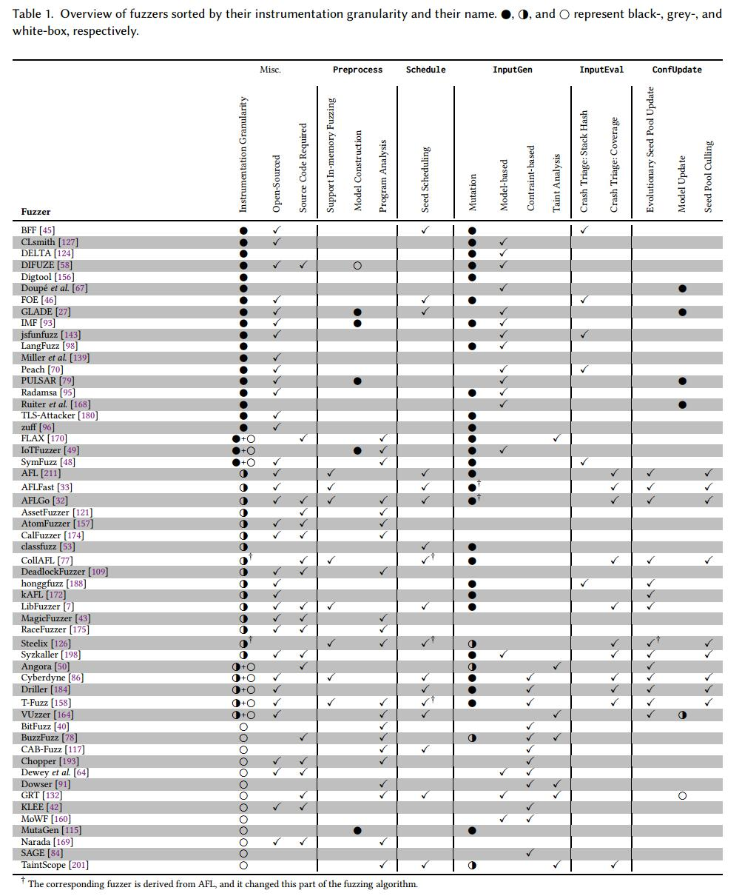

# Abstract

在当今可用的众多软件漏洞发现技术中，模糊测试由于其概念简单，部署的低屏障以及发现现实世界软件漏洞的大量经验证据而一直非常受欢迎。虽然近年来研究人员和从业人员都为改进模糊测试投入了大量不同的努力，但这项工作的激增也使得难以获得全面和一致的模糊测试观点。为了帮助保存并使大量的模糊测量文献保持连贯性，本文提出了一种统一的，通用的模糊测试模型以及当前模糊文献的分类。我们通过调查相关文献和艺术，科学和工程方面的创新，有条不紊地探索模型模糊器的每个阶段的设计决策，使现代模糊器有效。

| relevant information |                                                              |
| -------------------- | ------------------------------------------------------------ |
| *作者*               | VALENTIN J.M. MANÈS，HYUNGSEOK HAN,CHOONGWOO HAN,SANG KIL CHA∗,MANUEL EGELE,EDWARD J. SCHWARTZ,MAVERICK WOO, |
| *单位*               |                                                              |
| *出处*               | CSUR‘19                                                      |
| *原文地址*           | <https://github.com/wtwofire/database/blob/master/papers/fuzzing/Review/2019-fuzzing%EF%BC%9A%20Art%2C%20Science%2C%20and%20Engineering.pdf> |
| *源码地址*           |                                                              |
| *发表时间*           | 2019                                                         |

# 1. 简介

自从20世纪90年代初引入[139]以来，模糊测试一直是发现软件安全漏洞的最广泛部署的技术之一。在高级别，模糊测试指的是重复运行程序和构造的输入的过程，该输入可能在语法上或语义上不正确。在实践中，攻击者通常在诸如漏洞利用生成和渗透测试的场景中部署模糊测试[20,102]; 2016年DARPA网络大挑战赛（CGC）的几支队伍也在他们的网络推理系统中使用模糊测试[9,33,87,184]。在这些活动的推动下，防御者开始使用模糊测试来试图在攻击者发现漏洞之前发现漏洞。例如，Adobe [1]，Cisco [2]，Google [5,14,55]和Microsoft [8,34]等知名厂商都将模糊测试作为其安全开发实践的一部分。最近，安全审计员[217]和开源开发人员[4]也开始使用模糊测试来衡量商品软件包的安全性，并为最终用户提供一些合适的保证形式。

模糊社区非常有活力。在撰写本文时，仅GitHub就拥有了超过一千个与模糊测试相关的公共存储库[80]。正如我们将要展示的那样，文献中还包含大量的模糊器（参见第7页的图1），并且越来越多的模糊测试研究出现在主要安全会议上（例如[33,48,164,165,199,206] ]）。此外，博客圈中充满了许多模糊测试的成功故事，其中一些还包含了我们认为是[精华](https://goo.gl/37GYKN )的东西，这些精华在文献中占有一席之地。

不幸的是，研究人员和从业人员在模糊测试方面的工作激增也带来了阻碍进展的警告信号。例如，一些模糊器的描述不会超出其源代码和手册页。因此，随着时间的推移，很容易忘记这些模糊测试中的设计决策和潜在的重要调整。此外，各种模糊器使用的术语中存在可观察到的碎片。例如，虽然AFL [211]使用术语“测试用例最小化”来指代减小崩溃输入大小的技术，但同样的技术在funfuzz中也被称为“测试用例减少”[143]。虽然BFF [45]包含一种称为“崩溃最小化”的技术，听起来非常相似，但崩溃最小化的目的实际上是最小化崩溃输入和原始种子文件之间不同的位数，而不是减少崩溃输入的大小。我们认为这种分散使得难以发现和传播 fuzzing 知识，从长远来看，这可能严重阻碍 fuzzing 研究的进展。

基于我们的研究和我们在模糊测试方面的个人经验，本文作者认为现在是整合和提炼模糊测试大量进展的黄金时间，其中许多是在2007-2008 [73,187,189]年出版的三本关于该主题的贸易书籍之后发生的 。我们注意到Li等人同时进行了调查。 [125]侧重于基于覆盖的模糊测试的最新进展，但我们的目标是提供有关该领域近期发展的综合研究。为此，我们将首先使用§2来展示我们的模糊术语和统一的模糊测试模型。坚持本文的目的，选择我们的模糊术语来密切反映当前的主要用法，我们的模型模糊器（算法1，第4页）旨在适应大量的模糊测试任务，如分类在目前的模糊文献（图1，第7页）。通过这种设置，我们将在§3-§7中有条不紊地探索模型模糊器的每个阶段，并在表1中详细介绍主要模糊器（第9页）。
在每个阶段，我们将调查相关文献来解释设计选择，讨论重要的权衡，并突出许多奇妙的工程努力，帮助使现代模糊器有效地完成他们的任务。

# 2. 系统化，分类和测试程序

术语“fuzz”最初由Miller等人创造。在1990年，它指的是“生成一个由目标程序消耗的随机字符流”的程序[139，p.4]。从那时起，模糊的概念及其动作 - “fuzzing” - 出现在各种各样的语境中，包括动态符号执行[84,207]，基于语法的测试用例生成[82,98,196]，权限测试[21,74]，行为测试[114,163,205]，表示依赖性测试[113]，函数检测[208]，健壮性评估[204]，漏洞利用开发[104]，GUI测试[181]，签名生成[66]和渗透测试[75,145]。为了使大量的模糊测试文献中的知识系统化，让我们首先提出从当前使用中提取的模糊测试术语。

## 2.1 Fuzzing & Fuzzing Testing

直观地说，fuzzing是使用“模糊输入”运行被测程序（PUT）的行为。Honoring Miller等人，我们认为模糊输入是PUT可能不期望的输入，即PUT可能错误处理的输入并且触发PUT开发者无意识的行为。为了捕捉这个想法，我们将术语fuzzing定义如下。

> **定义2.1（fuzzing）**。模糊测试是使用从输入空间（“模糊输入空间”）采样的输入执行PUT，该输入空间突出了PUT的预期的输入空间。

三个评论是有序的。首先，尽管通常看到模糊输入空间包含预期的输入空间，但这不是必需的 - 前者包含d的输入不在后者中就足够了。其次，在实践中，模糊测试几乎肯定会进行多次迭代;因此，在上面写“重复执行”仍然很准确。第三，抽样过程不一定是随机的，我们将在§5中看到.

Fuzz testing是一种利用fuzzing的软件测试技术。为了区别于其他人并尊重我们认为最突出的目标，我们认为它有一个特定的目标，即找到与安全相关的错误，其中包括程序崩溃。此外，我们还定义了fuzzer和fuzz campaign，这两者都是模糊测试中的常用术语。

> **定义2.2（Fuzz Testing）**。Fuzz Testing是使用fuzzing，其目标是测试PUT违反安全策略的地方。
> **定义2.3（Fuzzer）**。Fuzzer是一种在PUT上执行fuzz testing的程序。
> **定义2.4（Fuzz Campaign）**。Fuzz Campaign是一个在有特定安全策略的PUT上的特定执行的Fuzzer。

通过fuzzing campaign运行PUT的目的是找到违反所需安全策略的错误[23]。例如，早期fuzzer使用的安全策略仅测试生成的输入 - 测试用例 - 是否使PUT崩溃。但是，fuzz testing 实际上可用于测试任何可执行的安全策略，即EMenforceable [171]。决定执行是否违反安全策略的具体机制称为**bug oracle**。

> **定义2.5（Bug Oracle）**。 bug oracle是一个程序，可能作为fuzzer的一部分，用于确定PUT的给定执行是否违反特定的安全策略。

 我们将fuzzer实现的算法简称为**“fuzz algorithm”**。几乎所有 fuzz algorithm都依赖于PUT之外的一些参数（路径）。参数的每个具体设置都是**fuzz configuration：**

> **定义2.6（Fuzz Configuration）**。fuzz algorithm的fuzz configuration包括控制fuzz algorithm的参数值。

Fuzz configuration通常被写为元组。请注意，fuzz configuration中的值类型取决于fuzz algorithm的类型。例如，将随机字节流发送到PUT [139]的fuzz algorithm具有简单的配置空间{（PUT）}。另一方面，复杂的fuzzer包含接受一组配置并随时间推移设置的算法 - 这包括添加和删除配置。例如，CERT BFF [45]在活动过程中改变了突变率和种子（在第5.2节中定义），因此其配置空间为{(PUT，s1，r1)，(PUT，s2，r2）,. … }。最后，对于每个配置，我们还允许fuzzer存储一些数据。例如，覆盖引导的模糊器可以存储每个配置的获得的覆盖范围。

## 2.2 Paper Selection Criteria

为了达到明确的范围，我们选择在2008年1月至2018年5月的4个主要安全会议和3个主要软件工程会议的最后一个议程中包括所有关于模糊测试的出版物。按字母顺序排列，前者包括（i）ACM会议计算机和通信安全（`CCS`），（ii）IEEE安全和隐私（`S＆P`）研讨会，（iii）网络和分布式系统安全研讨会（`NDSS`），以及（iv）USENIX安全研讨会（`USEC`）;后者包括（i）ACM国际软件工程基础研讨会（`FSE`），（ii）IEEE / ACM自动软件工程国际会议（`ASE`），以及（iii）国际软件工程会议（`ICSE`）。对于出现在其他场所或媒介中的作品，我们根据自己对其相关性的判断将它们包括在内。

正如§2.1中所提到的，fuzz testing与软件测试的区别仅在于它与安全相关。尽管瞄准安全漏洞并不意味着除了在理论上使用bug oracle之外的测试过程中存在差异，但所使用的技术在实践中通常会有所不同。在设计测试工具时，我们经常假设源代码的存在和PUT的知识。与fuzzer相比，这些假设通常会将工具的开发推向不同的形状。尽管如此，这两个领域仍然彼此纠缠不清。因此，当我们自己的判断力不足以区分它们时，我们遵循一个简单的经验法则：如果出版物中没有出现fuzz这个词，我们就不包括它。

## 2.3 Fuzz Testing Algorithm

我们提出了一种用于fuzz testing的通用算法，算法1，我们想象它已经在模型fuzzer中实现。它足以适应现有的模糊测试技术，包括§2.4中定义的黑色，灰色和白盒模糊测试。算法1将一组fuzz configurations C和一个超时 t_limit 作为输入，并输出一组发现的错误B.它由两部分组成。第一部分是预处理功能，它在fuzz campaign开始时执行。第二部分是循环内的一系列五个函数：**Schedule，InputGen，InputEval，ConfUpdate和Continue**。此循环的每次执行都称为**fuzz iteration**，并且在单个测试用例上执行InputEval称为**fuzz run**。请注意，一些模糊器不会实现所有五个功能。例如，为了模拟Radamsa [95]，我们让ConfUpdate简单地返回C，即它不会更新C.

**Preprocess（C）–>C**

>  用户为Preprocess提供一组fuzz configurations作为输入，并返回一组可能已修改的fuzz configurations。根据fuzz algorithm，Preprocess可以执行各种操作，例如将检测代码插入PUT，或测量种子文件的执行速度。见§3

**Schedule(C,telapsed,tlimit) –> conf **

> Schedule接收当前的fuzz configurations，当前时间t_elapsed和超时t_limit作为输入，并选择要用于当前模糊迭代的fuzz configuration。见§4。

**InputGen（conf）–>tcs **

> InputGen将fuzz configurations作为输入，并返回一组具体测试用例 tcs 作为输出。生成测试用例时，InputGen使用conf中的特定参数。一些模糊测试器使用conf中的种子来生成测试用例，而其他模糊器则使用模型或语法作为参数。见§5。

**InputEval (conf, tcs, Obug) –> B′, execinfos**

> InputEval采用fuzz配置conf，一组测试用例 tcs 和一个bug oracle Obug作为输入。它在tcs上执行PUT并使用bug oracle O_bug检查执行是否违反了安全策略。然后它输出发现的错误集B'和关于每个fuzz运行的信息 execinfos。我们假设O_bug嵌入在我们的模型模糊器中。见§6。

**ConfUpdate(C，conf，execinfos) –> C **

> ConfUpdate采用一组fuzz configurations C，当前配置 conf，以及每个模糊运行的信息 execinfos作为输入。它可能会更新一组fuzz configurations C.例如，许多灰盒模糊器会根据execinfos减少C中的模糊配置数量。见§7。

**Continue (C) –>  {True, False} **

> Continue将一组fuzz configurations C作为输入，并输出一个布尔值，指示是否应该进行下一个模糊迭代。此功能对于模型白盒模糊器很有用，当没有更多路径可以发现时，它可以终止。

## 2.4  Fuzzers 的分类

在本文中，我们根据模糊器在每个模糊运行中观察到的语义粒度将模糊器分为三组：黑盒，灰盒和白盒fuzzer。请注意，这与传统的软件测试不同，传统的软件测试只有两个主要类别（黑盒和白盒测试）[147]。正如我们将在§2.4.3中讨论的那样，灰盒模糊测试是白盒模糊测试的一种变体，它只能从每次模糊运行中获取一些部分信息。 

图1按时间顺序列出了现有fuzzer的分类。从Miller等人的开创性工作开始。 [139]，我们手动选择了在大型会议上出现或获得超过100个GitHub stars的流行fuzzer，并将其关系显示在图上。黑盒fuzzer位于图的左半部分，灰盒和白盒模糊器位于右半部分。

表1详细介绍了主要会议上出现的每个主要fuzzer所使用的技术。由于空间限制，我们省略了几个主要的fuzzer。每个模糊器都投影在我们上面提到的模型模糊器的五个功能上，其中一个杂项部分提供了有关fuzzer的额外细节。第一列（检测粒度）表示基于静态或动态分析从PUT获取多少信息。当fuzzer在两个阶段使用不同类型的插桩时，出现两个圆圈。例如，SymFuzz [48]运行白盒分析作为预处理，以便为随后的黑盒活动提取信息，而Driller [184]在白盒和灰盒模糊之间交替进行。

+ **第二列**显示来源是否公开。

+ **第三列**表示模糊器是否需要源代码才能运行。

+ **第四列**指出了模糊器是否支持内存模糊测试（参见§3.1.2）。

+ **第五列**是关于fuzzer是否可以推断模型（参见§5.1.2）。

+ **第六列**显示了在Preprocess中，fuzzer是执行静态分析还是动态分析。**第七列**指示fuzzers是否支持处理多个种子，并执行调度。

+ **变异列**指定fuzzers是否执行输入变异以生成测试用例。我们使用“半黑半白”来表示fuzzer根据执行反馈引导输入变异。基于模型的专栏是关于fuzzer是否基于模型生成测试用例。

+ **基于约束的列**显示fuzzers执行符号分析以生成测试用例。**污点分析列**意味着模糊测试器利用污点分析来指导其测试用例生成过程。

+ **InputEval部分**中的两列显示fuzzers是使用堆栈哈希还是使用代码覆盖率执行崩溃分类。

+ **ConfUpdate部分**的第一列指示在ConfUpdate期间模糊器是否进化种子池，例如，向池中添加有趣的种子（参见§7.1）。 ConfUpdate部分的第二列是关于fuzzers是否以在线方式学习模型。最后，ConfUpdate部分的第三列显示了从种子池中删除种子（参见§7.2）。

###  2.4.1黑盒fuzzer

术语“黑盒”通常用于软件测试[29,147]，fuzzing表示没有看到PUT内部的技术 - 这些技术只能观察PUT的输入/输出行为，将其视为一个黑盒子。在软件测试中，黑盒测试也称为IO驱动或数据驱动测试[147]。大多数传统的模糊器[6,13,45,46,96]属于这一类。一些现代模糊器，例如`funfuzz` [143]和`Peach` [70]，也考虑了有关输入的结构信息，以生成更有意义的测试用例，同时保持不检查PUT的特性。类似的直觉用于自适应随机测试[51]。

### 2.4.2白盒Fuzzer

在频谱的另一个极端，白盒模糊[84]通过分析PUT的内部和执行PUT时收集的信息来生成测试用例。因此，白盒模糊器能够系统地探索PUT的状态空间。术语白盒模糊是由Godefroid [81]在2007年引入的，它指的是动态符号执行（DSE），它是符号执行的变体[35,101,118]。在DSE中，符号和具体执行同时进行，其中具体的程序状态用于简化符号约束，例如，具体化系统调用。因此，DSE通常被称为concolic testing（具体的+符号的）[83,176]。此外，白盒模糊测试也被用于描述采用污点分析的模糊器[78]。
白盒模糊测试的开销通常远高于黑盒模糊测试的开销。这部分是因为DSE实现[22,42,84]经常采用动态插桩和SMT求解[142]。虽然DSE是一个活跃的研究领域[34,82,84,105,160]，但许多DSE不是白盒模糊器，因为它们的目的不是找到安全漏洞。因此，本文没有提供有关DSE的全面调查，我们将读者引用到最近的调查论文[16,173]以获取更多信息。

### 2.4.3灰盒Fuzzer

一些安全专家[62,72,189]提出了一种中间方法，并将其称为灰盒模糊测试。通常，灰盒模糊器可以获得PUT内部和/或其执行的一些信息。与白盒模糊器不同，灰盒模糊器不具备PUT的完整语义;相反，他们可以对PUT执行轻量级静态分析和/或收集有关其执行的动态信息，例如覆盖范围。 Greybox模糊器使用信息近似来测试更多输入。尽管安全专家之间通常存在共识，但黑盒，灰盒和白盒模糊测试之间的区别并不总是很明显。黑盒模糊器可能仍会收集一些信息，而白盒模糊器通常被迫做一些近似。本次调查中的选择，特别是表1中的选择，是有争议的，但是作者最好的判断。

灰盒模糊器的早期示例是EFS [62]，它使用从每个模糊运行中收集的代码覆盖率来使用进化算法生成测试用例。 `Randoop` [155]也使用了类似的方法，但它没有针对安全漏洞。现代模糊器如`AFL` [211]和`VUzzer` [164]是此类别中的示例。

# 3 预处理(PREPROCESS)

一些模糊器在第一次模糊迭代之前修改了初始的fuzz configurations。这种预处理通常用于插桩PUT，清除潜在的冗余配置（即(seed selection)种子选择[165]），并修剪种子

## 3.1 插桩（Instrumentation ）

与黑盒模糊器不同，灰盒和白盒模糊器可以在InputEval执行模糊运行（参见§6），或者在运行时模糊内存内容时插桩PUT以收集执行反馈。虽然还有其他方法可以获取PUT内部的信息（例如处理器跟踪或系统调用[86,188]），但插桩通常是收集最有价值信息的方法，因此几乎完全定义了颜色。模糊（从表1的第一列）。

程序插桩可以是静态的也可以是动态的 - 前者在PUT运行之前发生，而后者在PUT运行时发生。由于静态检测在运行时之前发生，因此它通常比动态检测产生更少的运行时开销。

静态插桩通常在编译时在源代码或中间代码上执行。如果PUT依赖于库，则必须单独插桩它们，通常通过使用相同的插桩重新编译它们。除了基于源代码的插桩，研究人员还开发了二进制级静态插桩（即二进制重写）工具[71,122,218]。

虽然它比静态插桩具有更高的开销，但动态插桩的优势在于它可以轻松地插桩动态链接库，因为插桩是在运行时执行的。有几种众所周知的动态插桩工具，如`DynInst `[161]，`DynamoRIO` [38]，`Pin `[131]，`Valgrind` [152]和`QEMU` [30]。通常，动态插桩在运行时发生，这意味着它对应于模型中的InputEval。但为了方便读者，我们在本节中总结了静态和动态插桩。

给定的模糊器可以支持多种类型的插桩。例如，AFL在源代码级别使用修改后的编译器支持静态插桩，或者在QEMU的帮助下支持二进制级别的动态插桩[30]。使用动态插桩时，AFL可以插桩（1）PUT本身的可执行代码（默认设置），或者（2）PUT中的可执行代码和任何外部库（使用AFL_INST_LIBS选项）。第二个选项 - 插桩所有遇到的代码 - 可以报告外部库中代码的覆盖信息，从而提供有关覆盖范围的更完整的图像。但是，这反过来会导致AFL模糊外部库函数中的其他路径。

### 3.1.1执行反馈（Execution Feedback. ）

灰盒模糊器通常将执行反馈作为输入来演化测试用例。 AFL及其后代通过检测PUT中的每个分支指令来计算分支覆盖。但是，它们将分支覆盖信息存储在一个byte向量中，这可能导致路径冲突。 `CollAFL` [77]最近通过引入一个新的路径敏感哈希函数来解决这个问题。同时，`LibFuzzer` [7]和`Syzkaller` [198]使用节点覆盖作为执行反馈。` Honggfuzz `[188]允许用户选择要使用的执行反馈。

### 3.1.2 内存模糊测试（In-Memory Fuzzing ）

在测试大型程序时，有时需要仅模糊PUT的一部分而不为每个模糊迭代重新生成进程，以便最小化执行开销。例如，复杂（例如，GUI）应用程序在接受输入之前通常需要几秒钟的处理。模糊这些程序的一种方法是在初始化GUI之后拍摄PUT的快照。为了模糊新的测试用例，可以在将新测试用例直接写入内存并执行之前恢复内存快照。同样的直觉适用于涉及客户端和服务器之间的大量交互的模糊网络应用程序。这种技术称为内存模糊[97]。例如，`GRR` [86,194]在加载任何输入字节之前创建快照。这样，它可以跳过不必要的启动代码。 AFL还使用fork服务器来避免一些流程启动成本。尽管它与内存模糊测试具有相同的动机，但是fork服务器涉及为每个模糊迭代分离一个新进程（参见§6）。

一些模糊器[7,211]对函数执行内存模糊测试，而不会在每次迭代后恢复PUT的状态。我们称这种技术为内存API模糊测试。例如，AFL有一个名为persistent mode [213]的选项，它在循环中重复执行内存API模糊测试而不重新启动进程。在这种情况下，AFL忽略了在同一执行中被多次调用的函数的潜在副作用。

虽然有效的内存API模糊测试会受到不合理的模糊测试结果的影响：内存模糊测试中发现的错误（或崩溃）可能无法重现，因为（1）为目标函数构造有效的调用上下文并不总是可行的，并且（ 2）可能存在多个函数调用未捕获的副作用。请注意，内存中API模糊的健全性主要取决于入口点函数，找到这样的函数是一项具有挑战性的任务。

### 3.1.3线程调度（Thread Scheduling ）

竞争条件错误可能难以触发，因为它们依赖于可能不经常发生的非确定性行为。但是，通过显式控制线程的调度方式，也可以使用插桩来触发不同的非确定性程序行为[43,410,121,157,169,174,175]。现有工作表明，即使是随机调度线程也可以有效地找到竞争条件错误[174]。

## 3.2 种子选择（seed selection problem）

回忆§2，模糊器接收一组控制fuzzing algorithm行为的fuzz configurations。不幸的是，fuzz configurations的一些参数，例如基于突变的模糊器的种子，具有大的值域。例如，假设分析师模糊测试接受MP3文件作为输入的MP3播放器。有无数的有效MP3文件，这提出了一个自然的问题：我们应该使用哪些种子进行模糊测试？这个问题被称为(**seed selection problem** )种子选择问题[165]。

有几种方法和工具可以解决种子选择问题[70,165]。常见的方法是找到最大化覆盖度量的最小种子集，例如节点覆盖，并且该过程称为计算最小集。例如，假设当前配置集C由两个seeds s1和s2组成，它们覆盖PUT的以下地址：{s1→{10,20}，s2→{20,30}}。如果我们有第三个种子s3→{10,20,30}的执行速度与s1和s2一样快，那么人们可能会认为fuzz s3而不是s1和s2是有意义的，因为它直观地测试了更多程序逻辑以一半的执行时间成本。这种直觉得到了Miller的报告[140]的支持，该报告显示，代码覆盖率增加1％会使发现的错误百分比增加0.92％。如§7.2所述，此步骤也可以是ConfUpdate的一部分。

Fuzzers在实践中使用各种不同的覆盖度量。例如，AFL的minset基于分支覆盖，每个分支上都有一个对数计数器。该决定背后的基本原理是，只有当分支计数在数量级上不同时才允许它们被认为是不同的。 Honggfuzz [188]根据执行指令数，执行分支数和唯一基本块计算覆盖率。此度量标准允许模糊器向minset添加更长的执行时间，这有助于发现拒绝服务漏洞或性能问题。

## 3.3 种子修剪（Seed Trimming ）

较小的种子可能消耗较少的内存并且意味着更高的吞吐量。因此，一些模糊器试图在模糊种子之前减小种子的尺寸，这称为种子修剪。种子修剪可以在Preprocess中的主模糊循环之前或作为ConfUpdate的一部分进行。使用种子修剪的一个值得注意的模糊器是AFL [211]，只要修改后的种子达到相同的覆盖范围，它就使用其代码覆盖率插桩迭代地移除一部分种子。同时，雷伯特等人 [165]报道，他们的size minset算法，通过给予较小的种子更高优先级来选择种子，与随机种子选择相比，导致更少数量的独特错误。

## 3.4准备驱动程序

应用程序当难以直接fuzz PUT时，准备一个模糊驱动程序是有意义的。这个过程在很大程度上是手动的，尽管这只在模糊测试活动开始时才进行一次。例如，当我们的目标是库时，我们需要准备一个调用库中函数的驱动程序。类似地，内核模糊器可能会模糊用户态应用程序来测试内核[28,117,154]。 `MutaGen` [115]利用其他程序（驱动程序）中包含的PUT知识进行模糊测试。具体来说，它使用动态程序切片来改变驱动程序本身，以生成测试用例。 `IoTFuzzer` [50]通过让驱动程序成为相应的智能手机应用程序来定位物联网设备。

# 4 调度(SEHEDULING)

在模糊测试中，调度意味着为下一个模糊运行选择模糊配置。正如我们在§2.1中所解释的，每个配置的内容取决于模糊器的类型。对于简单的模糊器，调度可以很简单 - 例如，`zzuf` [96]在其默认模式下只允许一个配置（PUT和其他参数的默认值），因此根本没有决定。但对于更高级的模糊器，如`BFF` [45]和`AFLFast` [33]，他们成功的一个主要因素在于他们的创新调度算法。在本节中，我们将仅讨论黑盒和灰盒模糊测试的调度算法;白盒模糊测试中的调度需要符号执行器独有的复杂设置，我们将读者引用到[34]。

## 4.1  Fuzz配置调度（FCS）问题(The Fuzz Configuration Scheduling (FCS) Problem)

调度的目标是分析当前可用的配置信息，并选择一个更有可能产生最有利结果的信息，例如，找到最多的唯一错误，或生成的输入集所达到的最大化覆盖范围。从根本上说，每个调度算法都面临相同的探索与剥削冲突，时间可以花费在收集关于每个配置的更准确信息上，以便为将来的决策（探索）提供信息，或者模糊当前被认为可以产生更有利结果的配置。 （利用）。 Woo等人 [206]将此固有冲突称为模糊配置调度（FCS）问题。

在我们的模型模糊器（算法1）中，函数Schedule基于（i）当前的模糊配置集 C，（ii）当前时间 t_elapsed，以及（iii）总时间预算 t_limit 来选择下一个配置。然后，此配置将用于下一次模糊运行。请注意，Schedule仅与决策有关。完成此决策的信息由 Preprocess 和 ConfUpdate 通过更新C获取。

## 4.2 黑盒FCS 算法

在黑盒设置中，FCS算法可以使用的唯一信息是配置的模糊结果 - 与其一起发现的崩溃和错误的数量以及到目前为止花费的时间。 `Householder`和`Foote` [100]是第一个研究如何在CERT BFF黑盒突变模糊器中利用这些信息的人[45]。他们假定应该优先选择观察成功率较高的配置（#bugs / #runs）。事实上，在替换BFF中的统一采样调度算法后，他们观察到在运行 ffmpeg 500万次中独特崩溃次数增加了85％，证明了更先进的FCS算法的潜在优势。

不久之后，Woo等人在多个方面改进了上述想法 [206]。首先，他们从[100]中的伯努利试验序列到`Weighted Coupon
Collector’s Problem with Unknown Weights`（WCCP / UW），改进了黑盒突变模糊测试的数学模型。前者假设每个配置具有固定的最终成功概率并且随着时间的推移而学习它，后者在衰减时明确地保持该概率的上限。其次，WCCP / UW模型自然会引领Woo等人去研究`multi-armed bandit`（MAB）问题的算法，这是一种流行的形式以应对决策科学中的探索与剥削冲突[31]。为此，他们能够设计MAB算法以准确地利用尚未发生衰减的配置。第三，他们观察到，在其他条件相同的情况下，让fuzzing更快的配置允许模糊器收集更多的独特错误，或者更快地降低其未来成功概率的上限。这激发了他们将配置的成功概率标准化为花费在其上的时间，从而使得更快的配置更加可取。第四，他们将BFF中模糊运行的编排从每个配置选择的固定运行次数（BFF用语中的“epochs”）改为每次选择的固定时间量。通过此更改，BFF不再需要在可重新选择之前花费更多时间在慢速配置中。通过组合上述内容，评估[206]显示使用与现有BFF相同的时间量发现的独特错误数量增加1.5倍。

## 4.3 灰盒FCS算法

在灰盒设置中，FCS算法可以选择使用关于每种配置的更丰富的信息集，例如，在模糊配置时获得的覆盖范围。 AFL [211]是此类别的先行者，它基于进化算法（EA）。直观地，EA维持一组配置，每个配置具有一些“适应性”值。 EA选择合适的配置并将其应用于遗传转化，例如突变和重组，以产生后代，后代可能成为新的配置。假设是这些产生的配置更可能适合。

要在EA的上下文中理解FCS，我们需要定义**（i）使配置适合的内容是什么，（ii）如何选择配置，以及（iii）如何使用所选配置**。作为高级近似法，在执行控制流边缘的配置中，AFL认为包含最快和最小输入的那个适合（AFL用语中的“favorite”）。 AFL维护一个配置队列，从中选择下一个匹配配置，就好像队列是循环的一样。一旦选择了配置，AFL就会使其基本上以恒定的运行次数进行模糊处理。从FCS的角度来看，请注意快速配置的首选项与黑盒设置的[206]相同。

最近，Böhme等人的AFLFast [33]在上述三个方面的每个方面都改进了AFL。首先，AFLFast为输入添加了两个最重要的标准，使其成为“favorite”：（i）在执行控制流边缘的配置中，AFLFast倾向于选择最少的输入。这具有在执行该边缘的配置之间循环的效果，从而增加了探索。 （ii）当（i）中存在平局时，AFLFast倾向于选择其中执行最少路径的那个。这具有增加稀有路径的执行效果，这可能揭示更多未观察到的行为。其次，AFLFast放弃了AFL中的循环选择，而是根据优先级选择下一个拟合配置。特别是，如果选择配置的频率较低，或者在平局时，如果它运行的路径较少，则适配配置的优先级高于另一配置。与第一次改变的想法相同，这具有增加适合配置和稀有路径执行的探索的效果。第三，AFLFast根据能量计划确定所选配置的次数变量。 AFLFast中的FAST能量计划以较小的“能量”值开始，以确保配置之间的初始探索，并以指数方式增加到极限，以快速确保充分利用。此外，它还通过生成相同路径的生成输入的数量来标准化能量，从而促进对频率较低的模糊配置的探索。这些变化的总体影响非常显着 - 在24小时的评估中，Böhme等人观察到AFLFast发现了AFL没有发现的3个错误，并且在两者都发现的6个错误上比AFL快7倍。 AFLGo [32]通过修改其优先级来扩展AFLFast，以便针对特定的程序位置。 QTEP [200]使用静态分析来推断二进制文件的哪个部分更“错误”并优先考虑覆盖它们的配置。

# 5.输入生成(INPUT GENERATION)

由于测试用例的内容直接控制是否触发bug，因此输入生成技术自然是模糊测试中最有影响力的设计决策之一。传统上，模糊器分为基于生成或基于突变的模糊器[187]。基于生成的模糊器基于给定模型生成测试用例，该模型描述了PUT期望的输入。我们在本文中称这种模糊器为基于模型的模糊器。另一方面，基于突变的模糊器通过改变给定的种子输入来产生测试案例。基于突变的模糊器通常被认为是无模型的，因为种子仅仅是示例输入，并且即使在大量数量下它们也不能完全描述PUT的预期输入空间。在本节中，我们将基于底层测试用例生成（InputGen）机制对模糊器使用的各种输入生成技术进行解释和分类。

## 5.1基于模型（基于生成）的模糊器

基于模型的模糊器基于给定模型生成测试用例，该模型描述了PUT可以接受的输入或执行，例如精确表征输入格式的语法或不太精确的约束,例如标识文件类型的magic值。

### 5.1.1预定义模型

一些模糊器使用可由用户配置的模型。例如，Peach [70]，PROTOS [112]和Dharma [3]接受用户提供的规范。 Autodafé [197]，Sulley [15]，SPIKE [13]和SPIKEfile [186]公开了API，允许分析师创建自己的输入模型。 Tavor [219]还接受以Extended Backus-Naur形式（EBNF）编写的输入规范，并生成符合相应语法的测试用例。类似地，诸如PROTOS [112]，SNOOZE [26]，KiF [12]和T-Fuzz [107]之类的网络协议模糊器也接受来自用户的协议规范。内核API模糊器[108,146,151,198,203]以系统调用模板的形式定义输入模型。这些模板通常指定系统调用期望作为输入的参数的数量和类型。在内核模糊测试中使用模型的想法源于Koopman等人 [119]开创性的工作，他们将操作系统的稳健性与一系列有限的手动选择的系统调用测试用例进行了比较。

其他基于模型的模糊器针对特定的语言或语法，并且该语言的模型内置于模糊器本身。例如，`cross_fuzz` [212]和`DOMfuzz` [143]生成随机文档对象模型（DOM）对象。同样，`jsfunfuzz` [143]基于其自己的语法模型生成随机但语法正确的JavaScript代码。 `QuickFuzz` [88]利用现有的Haskell库来描述生成测试用例时的文件格式。一些网络协议模糊器如`Frankencerts` [37]，TLS-Attacker [180]`，`tlsfuzzer `[116]`和`llfuzzer`[182]设计有特定网络协议模型，如TLS和NFC。 Dewey等人[63,64]提出了一种生成测试用例的方法，这些测试用例不仅语法正确，而且通过利用约束逻辑编程也具有语义多样性。`LangFuzz` [98]通过解析作为输入给出的一组种子来产生代码片段。然后它随机组合片段，并将种子与片段一起变异以生成测试用例。由于它提供了语法，因此它始终生成语法正确的代码。 LangFuzz应用于JavaScript和PHP。 BlendFuzz [210]基于与LangFuzz类似的想法，但它以XML和正则表达式解析器为目标。

### 5.1.2 推断模型

推断模型而不是依赖于预定义的逻辑或用户提供的模型获得牵引力。虽然有大量关于自动输入格式和协议逆向工程主题的已发表研究[25,41,57,60,128]，但只有少数模糊测试者利用这些技术。模型推断可以分两个阶段完成：`Preprocess`或`ConfUpdate`。
Preprocess中的模型推理。一些模糊推测器将模型推断为模糊运动之前的第一步。 TestMiner [61]使用代码中可用的数据来挖掘和预测合适的输入。 Skyfire [199]使用数据驱动方法从给定语法和一组输入样本生成一组种子。与以前的作品不同，他们的重点是生成一组语义上有效的新种子。 IMF [93]通过分析系统API日志来学习内核API模型，并生成使用推断模型调用一系列API调用的C代码。 Neural [56]和Learn＆Fuzz [85]使用基于神经网络的机器学习技术从给定的一组测试文件中学习模型，并使用推断的模型生成测试用例。Liu等人[129]提出了一种特定于文本输入的类似方法。

ConfUpdate中的模型推断。在每个模糊迭代中都有模糊器更新模型。 PULSAR [79]从捕获到的程序生成的一组的网络数据包中自动的推断出网络协议模型。然后，学习的网络协议用于模糊程序。 PULSAR在内部构建状态机，并映射哪个消息令牌与状态相关。此信息稍后用于生成覆盖状态机中更多状态的测试用例。 Doupé等人 [67]提出了一种通过观察I / O行为来推断Web服务的状态机的方法。然后使用推断的模型来扫描Web漏洞。Ruiter等人 [168]工作类似，但目标是TLS，并将其实施基于`LearnLib` [162]。最后，`GLADE` [27]从一组I / O样本中合成了一个无上下文语法，并使用推断的语法来模糊PUT。

## 5.2 无模型（基于突变）的模糊器

经典随机测试[19,92]在生成满足特定路径条件的测试用例时效率不高。假设有一个简单的C语句：if（input == 42）。如果输入是32位整数，则随机猜测正确输入值的概率是2的32次方之一。当我们考虑结构良好的输入（如MP3文件）时，情况会变得更糟。随机测试极不可能在合理的时间内生成有效的MP3文件作为测试用例。因此，MP3播放器将主要在到达程序的更深层部分之前的解析阶段拒绝从随机测试中生成的测试用例。

这个问题促使使用基于种子的输入生成以及白盒输入生成（见§5.3）。大多数无模型模糊器使用种子，它是PUT的输入，以便通过改变种子来生成测试用例。
种子通常是PUT支持的类型的结构良好的输入：文件，网络包或一系列UI事件。通过仅改变有效文件的一小部分，通常可以生成大多数有效的新测试用例，但也包含异常值以触发PUT的崩溃。有多种方法可用于改变种子，我们将在下面描述常见的方法。

### 5.2.1 比特翻转

比特翻转是许多无模型模糊器使用的常用技术[6,95,96,188,211]。一些模糊器简单地翻转固定数量的比特，而其他模糊器确定随机翻转的比特数。为了随机改变种子，一些模糊器使用一个称为突变比的用户可配置参数，该参数确定单次执行InputGen时要翻转的位位置数。假设一个模糊器想要从给定的N位种子中翻转K个随机位。在这种情况下，模糊器的突变比是K / N.
`SymFuzz`等 [48]表明模糊性能对突变率非常敏感，并且没有一个比率适用于所有PUT。有几种方法可以找到良好的突变率。 BFF [45]和FOE [46]使用每个种子的指数缩放比例集，并将更多迭代分配给证明在统计学上有效的突变比[100]。 SymFuzz [48]利用白盒程序分析来推断出良好的突变率。然而，请注意，所提出的技术仅考虑推断单个最佳突变比率。使用多个突变比率进行模糊测试比使用单个最佳比率进行模糊测试更有可能，这仍然是一个开放的研究挑战。

### 5.2.2 算术变异 

AFL [211]和honggfuzz [188]包含另一个变异操作，它将所选字节序列视为整数，并对该值执行简单算术。然后使用计算的值替换所选的字节序列。关键的直觉是通过少量的数值来限制突变的影响。例如，AFL从种子中选择一个4字节的值，并将该值视为整数 i。然后用 i ± r 替换种子中的值，其中r是随机生成的小整数。 r的范围取决于模糊器，通常是用户可配置的。在AFL中，默认范围是：0≤r<35。

### 5.2.3 基于块的变

有几种基于块的变异方法，其中块是种子的字节序列：（1）将随机生成的块插入种子的随机位置[7,211]; （2）从种子中删除随机选择的块[7,95,188,211]; （3）用随机值替换随机选择的块[7,95,188,211]; （4）随机置换一系列块的顺序[7,95]; （5）通过附加随机区块来调整种子的大小[188]; （6）从种子中取一个随机块来插入/替换另一个种子的随机块[7,211]。

### 5.2.4 基于字典的变异

一些模糊器使用具有潜在显着语义权重的一组预定义值，例如0或-1，以及用于变异的格式字符串。例如，AFL [211]，honggfuzz [188]和LibFuzzer [7]在变换整数时使用诸如0，-1和1的值。 Radamsa [95]使用Unicode字符串，GPF [6]使用格式字符（如％x和％s）来改变字符串。

## 5.3 白盒模糊器

白盒模糊器也可以分为基于模型或无模型的模糊器。例如，传统的动态符号执行[24,84,105,134,184]在基于变异的模糊器中不需要任何模型，但一些符号执行器[82,117,160]利用输入模型，如输入语法指导符号执行。

虽然许多白盒模糊器包括Godefroid等人[84]的开创性工作使用动态符号执行来生成测试用例，但并非所有的白盒模糊器都是动态符号执行器。一些模糊器[48,132,170,201]利用白盒程序分析来查找有关PUT接受的输入的信息，以便将其与黑盒或灰盒模糊测试一起使用。在本小节的其余部分中，我们将基于其基础测试用例算法简要总结现有的白盒模糊测试技术。请注意，我们故意省略动态符号执行器，如[42,47,54,83,176,192]，除非他们明确称自己为§2.2中提到的模糊器。

### 5.3.1 动态符号执行

在高级别，经典的符号执行[35,101,118]运行一个带有符号值作为程序的输入，它代表所有可能的值。在执行PUT时，它会构建符号表达式，而不是评估具体值。每当它到达条件分支指令时，它在概念上分叉两个符号解释器，一个用于真正的分支，另一个用于假分支。对于每个路径，符号解释器为执行期间遇到的每个分支指令构建路径公式（或路径谓词）。如果存在执行所需路径的具体输入，则路径公式是可满足的。可以通过查询SMT求解器[142]来生成具体输入，以获得路径公式的解。动态符号执行是传统符号执行的变体，其中符号执行和具体执行同时运行。这个想法是具体的执行状态可以帮助减少符号约束的复杂性。除了应用于模糊测试之外，对动态符号执行的学术文献的广泛回顾超出了本文的范围。然而，动态符号执行的更广泛处理可以在[16,173]中找到。

### 5.3.2 引导式模糊测试

一些模糊器利用静态或动态程序分析技术来增强模糊测试的有效性。这些技术通常涉及两个阶段的模糊测试：（i）用于获得关于PUT的有用信息的昂贵程序分析，以及（ii）在先前分析的指导下生成测试用例。这在表1的第六列（第9页）中表示。例如，TaintScope [201]使用细粒度污点分析来查找“热字节”，这是流入关键系统调用或API调用的输入字节。其他安全研究人员提出了类似的想法[69,103]。 Dowser [91]在编译期间执行静态分析，以找到可能包含基于启发式的错误的循环。具体来说，它查找包含指针解引用的循环。然后，它使用污点分析计算输入字节和候选循环之间的关系。最后，Dowser运行动态符号执行，同时只使关键字节成为符号，从而提高性能。VUzzer [164]和GRT [132]利用静态和动态分析技术从PUT中提取控制和数据流特征，并使用它们来指导输入生成。 Angora [50]通过使用污点分析将每个路径约束与相应的字节相关联来改进“热字节”的想法。然后，它通过梯度下降算法进行搜索，以指导其突变以解决这些约束。

### 5.3.3 PUT 突变

模糊测试的一个实际挑战是绕过校验和验证。例如，当PUT在解析输入之前计算输入的校验和时，来自模糊器的大多数生成的测试用例将被PUT拒绝。为了应对这一挑战，TaintScope [201]提出了一种校验和感知模糊测试技术，该技术通过污点分析识别校验和测试指令，并修补PUT以绕过校验和验证。一旦发现程序崩溃，它们就会为输入生成正确的校验和，以生成一个崩溃未修改的PUT的测试用例。 Caballero [40]提出了一种称为拼接动态符号执行的技术，它可以在校验和存在的情况下生成测试用例。

T-Fuzz [158]扩展了这个想法，通过灰盒模糊来有效地穿透所有类型的条件分支。它首先构建一组非关键检查（NCC），这些检查是可以在不修改程序逻辑的情况下进行转换的分支。当模糊测试活动停止发现新路径时，它会选择NCC，对其进行转换，然后在修改后的PUT上重新启动模糊测试活动。最后，当发现崩溃模糊转换程序时，T-Fuzz尝试使用符号执行在原始程序上重建它。

# 6. 输入评估

生成输入后，模糊器执行输入，并决定如何处理该输入。由于模糊测试的主要动机是发现违反安全策略的行为，因此模糊测试程序必须能够检测到执行违反安全策略的行为。该策略的实现称为bug oracle，O_bug（参见§2.1）。 oracle标记的输入通常在被分类后写入磁盘。如算法1所示，为模糊器生成的每个输入调用oracle。因此，oracle能够有效地确定输入是否违反安全策略是至关重要的。

回想一下§3，一些模糊器还在执行每个输入时收集附加信息，以改善模糊测试过程。 Preprocess和InputEval在许多模糊器中彼此紧密耦合，因为检测到的PUT（来自Preprocess）将在执行时输出附加信息（来自InputEval）。

## 6.1执行优化

我们的模型考虑按顺序执行单个模糊迭代。虽然这种方法的直接实现只是在每次模糊迭代开始时开始新过程时加载PUT，但是可以显着加速重复加载过程。为此，现代模糊器提供了跳过这些重复加载过程的功能。例如，AFL [211]提供了一个fork-server，它允许每个新的模糊迭代从已经初始化的进程中fork。类似地，内存中模糊测试是优化执行速度的另一种方法，如第3.1.2节中所述。无论确切的机制如何，加载和初始化PUT的开销都会在很多次迭代中摊销。Xu等人 [209]通过设计一个替换fork（）的新系统调用，进一步降低了迭代的成本。

## 6.2  Bug Oracles

与模糊测试一起使用的规范安全策略认为每个程序执行都会被致命信号（例如分段错误）终止。此策略检测到许多内存漏洞，因为使用无效值覆盖数据或代码指针的内存漏洞通常会导致分段错误或在取消引用时中止。此外，该策略高效且易于实现，因为操作系统允许模糊器在没有任何仪器的情况下捕获这种异常情况。

但是，传统的检测崩溃的策略不会检测到触发的每个内存漏洞。例如，如果堆栈缓冲区溢出使用有效的内存地址覆盖堆栈上的指针，则程序可能会运行完成且结果无效而不是崩溃，并且模糊器不会检测到此情况。为了缓解这种情况，研究人员提出了各种有效的程序转换，可以检测不安全或不需要的程序行为并中止程序。这些通常被称为`sanitizers`。

**内存和类型安全**。内存安全错误可以分为两类：空间和时间。非正式地，当指针被访问到其预期范围之外时，会发生空间存储器错误。例如，缓冲区溢出和下溢是空间内存错误的典型示例。在指针不在有效后访问时会发生时间内存错误。例如，use-after-free 漏洞，当一片内存的指针被释放之后又被使用，这是典型的时间内存错误。

`Address Sanitizer（ASan）`[177]是一个快速存储器错误检测器，可在编译时检测程序。 ASan可以检测空间和时间内存错误，平均减速仅为73％，使其成为基本碰撞安全带的有吸引力的替代品。 ASan采用了一个影子存储器，允许每个存储器地址在被解除引用之前被快速检查其有效性，从而允许它检测许多（但不是全部）不安全的存储器访问，即使它们不会使原始程序崩溃。 MEDS [94]通过利用64位虚拟空间提供的近乎无限的内存空间并创建`redzones`来改进ASAN。

`SoftBound / CETS `[148,149]是另一种在编译过程中监控程序的内存错误检测器。然而，SoftBound / CETS不是像ASan那样跟踪有效的内存地址，而是将边界和时间信息与每个指针相关联，理论上可以检测所有空间和时间内存错误。然而，正如预期的那样，这种完整性带来了更高的平均开销116％[149]。

`CaVer`[123]，`TypeSan`[90]和`HexType`[106]在编译期间插桩程序，以便它们可以检测C ++类型转换中的错误转换。当对象转换为不兼容的类型时，例如当基类的对象强制转换为派生类型时，会发生错误的转换。事实证明，CaVer可以扩展到Web浏览器，这些浏览器历来包含这种类型的漏洞，并且开销在7.6到64.6％之间。

另一类存储器安全保护是控制流完整性[10,11]（CFI），它在运行时检测原始程序中不可能的控制流转换。 CFI可用于检测非法修改程序控制流的测试用例。最近一个专注于防范CFI违规子集的项目已经进入主流gcc和clang编译器[191]。

**未定义的行为**。诸如C之类的语言包含许多由语言规范未定义的行为。编译器可以以各种方式自由处理这些构造。在许多情况下，程序员可以（有意或无意地）编写他们的代码，这样它只对某些编译器实现是正确的。虽然这看起来似乎不太危险，但许多因素都会影响编译器如何实现未定义的行为，包括优化设置，体系结构，编译器甚至编译器版本。当编译器的未定义行为的实现与程序员的期望不匹配时，通常会出现漏洞和错误[202]。

`Memory Sanitizer（MSan）`是一种工具，可以在编译期间检测程序，以检测由于在C和C ++中使用未初始化的内存而导致的未定义行为[183]。与ASan类似，MSan使用一个影子内存来表示每个可寻址位是否已初始化。 Memory Sanitizer的开销约为150％。

`Undefied Behavior Sanitizer（UBSan）`[65]在编译时修改程序以检测未定义的行为。与其他专注于未定义行为的特定来源的检测工具不同，UBSan可以检测各种未定义的行为，例如使用未对齐的指针，除以零，解除引用空指针和整数溢出。

`Thread Sanitizer（TSan）`[178]是一种编译时修改，它通过精度和性能之间的权衡来检测数据竞争。当两个线程同时访问共享内存位置并且至少一个访问是写入时，发生数据争用。这样的错误可能导致数据损坏，并且由于非确定性而极难重现。

**输入验证**。测试输入验证漏洞（如XSS（跨站点脚本）和SQL注入漏洞）是一个具有挑战性的问题，因为它需要了解为Web浏览器和数据库引擎提供支持的非常复杂的解析器的行为。`KameleonFuzz` [68]通过使用真实Web浏览器解析测试用例，提取文档对象模型树，并将其与人工提取的XSS工具模式进行比较来检测成功的XSS攻击。 `μ4SQLi`[17]使用类似的技巧来检测SQL注入。由于无法从Web应用程序响应中可靠地检测SQL注入，因此μ4SQLi使用数据库代理拦截目标Web应用程序与数据库之间的通信，以检测输入是否触发了有害行为。

**语义差异**。通常通过比较类似（但不同）的程序来发现语义错误。它通常被称为差分测试[135]，并被几个模糊器[37,53,159]使用。在这种情况下，bug oracle是作为一组类似的程序给出的。Jung等人 [111]引入了术语黑盒差分模糊测试，它测量了给定两个或更多不同输入的PUT输出之间的差异。根据输出之间的差异，它们检测PUT的信息泄漏。

## 6.3 分类

分类是分析和报告导致违反策略的测试用例的过程。分类可以分为三个步骤：重复数据删除，优先级排序和测试用例最小化。

### 6.3.1 重复数据删除

重复数据删除是从输出集中修剪与其它测试样例触发相同的错误的测试样例的过程，理想情况下，重复数据删除会返回一组测试用例，其中每个测试用例都会触发一个独特的错误。

由于多种原因，重复数据删除是大多数模糊器的重要组成部分。作为一种实际的实现方式，它通过在删除硬盘上存储重复的结果来避免浪费磁盘空间和其他资源。作为可用性考虑因素，重复数据删除使用户可以轻松了解存在多少不同的错误，并能够分析每个错误的示例。这对各种模糊用户都很有用；例如，攻击者可能只想查看可能导致可靠利用的“home run”漏洞。

目前在实践中使用了两种主要的重复数据删除实现：`堆栈回溯哈希`和``基于覆盖的重复数据删除``。

**堆栈回溯哈希**(Stack Backtrace Hashing )。堆栈回溯哈希[141]是用于重复数据删除崩溃的最古老和最广泛使用的方法之一，其中自动化工具在崩溃时记录堆栈回溯，并根据该回溯的内容分配堆栈散列。例如，如果程序在函数foo中执行一行代码时崩溃，并且调用堆栈为main→d→c→b→a→foo，那么n = 5的堆栈回溯散列实现会将所有执行组合在一起回溯以d→c→b→a→foo结束。

堆栈哈希实现差别很大，从哈希中包含的堆栈帧数开始。一些实现使用一个[18]，三个[141,206]，五个[45,76]，或者没有任何限制[115]。实现方式也包括每个堆栈帧中包含的信息量。某些实现只会哈希函数的名称或地址，但其他实现将哈希名称和偏移量或行。这两个选项都不能很好地工作，因此一些实现[76,137]产生两个哈希：主要和次要哈希。主要哈希很可能将不同的崩溃组合在一起，因为它只散列函数名称，而次要散列更精确，因为它使用函数名称和行号，并且还包括无限数量的堆栈帧。

虽然堆栈回溯哈希被广泛使用，但它并非没有缺点。堆栈回溯哈希的基本假设是类似的崩溃是由类似的错误引起的，反之亦然，但据我们所知，这个假设从未被直接测试过。有一些理由怀疑它的真实性：在导致崩溃的代码附近不会发生一些崩溃。例如，导致堆损坏的漏洞可能仅在代码的不相关部分尝试分配内存时崩溃，而不是在发生堆溢出时崩溃。

**基于覆盖的重复数据删除**（Coverage-based Deduplication ）。 AFL [211]是一种流行的灰盒模糊器，它采用高效的源代码检测器来记录PUT每次执行的边缘覆盖范围，并测量每个边缘的粗略命中计数。作为灰盒模糊器，AFL主要使用此覆盖信息来选择新的种子文件。但是，它也会导致相当独特的重复数据删除方案。正如其文档中所描述的那样，如果（i）碰撞覆盖了以前看不见的边缘，或者（ii）碰撞未覆盖所有早期碰撞中存在的边缘，AFL认为碰撞是唯一的。

**语义感知的重复数据删除**。Cui等人[59]提出了一个名为RETracer的系统，根据从反向数据流分析中恢复的语义对崩溃进行分类。具体来说，在崩溃之后，RETracer会检查哪个指针导致崩溃，并以递归方式识别哪个指令为其分配了错误值。它最终找到一个具有最大帧级别的函数，并“blames”该函数。blames功能可用于群集崩溃。作者表明，他们的技术成功地将数百万个Internet Explorer bugs合并为一个，这些漏洞通过堆栈散列分散到大量不同的组中。

### 6.3.2 优先级和可利用性

优先级，a.k.a.fuzzer taming问题[52]，是根据严重性和唯一性对违反测试用例进行排名或分组的过程。传统上使用模糊测试来发现内存漏洞，在这种情况下，优先级更好地称为确定崩溃的可利用性。可利用性非正式地描述了攻击者能够为测试用例暴露的漏洞编写实际漏洞的可能性。防御者和攻击者都对可利用的漏洞感兴趣。防御者通常会在不可利用的漏洞之前修复可利用的漏洞，并且出于显而易见的原因，攻击者对可利用的漏洞感兴趣。

第一个可利用性排名系统之一是Microsoft的 ``!exploitable` [137]，它的名字来自它提供的 !exploitable 的WinDbg命令名称。 ！exploitable采用了几种启发式方法，并配有简化的污点分析[153,173]。它按以下严重性等级对每次崩溃进行分类：EXPLOITABLE> PROBABLY_EXPLOITABLE> UNKNOWN> NOT_LIKELY_EXPLOITABLE，其中x> y表示x比y严重。虽然这些分类没有正式定义，但是可利用的非正式意图是保守和错误报告的东西比它更具可利用性。例如，！exploitable断定，如果执行非法指令，则崩溃是可利用的，这是基于攻击者能够劫持控制流的假设。另一方面，除零崩溃被视为NOT_LIKELY_EXPLOITABLE。

自从！exploitable被引入以来，已经提出了其他类似的基于规则的启发式系统，包括GDB [76]和Apple的``CrashWrangler `[18]的可利用插件。然而，它们的正确性尚未得到系统的研究和评估。

### 6.3.3测试用例最小化

分类的另一个重要部分是测试用例最小化。测试用例最小化是识别触发违规所必需的违规测试用例部分的过程，并且可选地产生比原始测试用例更小且更简单但仍然导致违规的测试用例。

一些模糊器使用自己的实现和算法。 BFF [45]包括针对模糊测试[99]的最小化算法，其尝试最小化与原始种子文件不同的比特数。AFL [211]还包括一个测试用例最小化器，它试图通过机会性地将字节设置为零并缩短测试用例的长度来简化测试用例。`Lithium `[167]是一种通用测试用例最小化工具，它通过尝试以指数递减的大小删除相邻行或字节的“块”来最小化文件。Lithium是由JavaScript模糊器（如jsfunfuzz [143]）生成的复杂测试案例推动的。

还有各种测试用例减少器，它们不是专门用于模糊测试，但仍可用于模糊测试识别的测试用例。这些包括格式不可知技术，如``delta调试``[216]，以及特定格式的专用技术，如`C-Reduce` [166]用于C / C ++文件。尽管专业技术明显受限于它们可以减少的文件类型，但它们的优势在于它们可以比通用技术更有效，因为它们了解它们试图简化的语法。

# 7.配置更新(CONFIGURATION UPDATING )

ConfUpdate函数在区分黑盒模糊器与灰盒和白盒模糊器的行为方面起着关键作用。如算法1中所讨论的，ConfUpdate函数可以基于在当前模糊测试运行期间收集的配置和执行信息来修改配置集（C）。在最简单的形式中，ConfUpdate返回未修改的C参数。除了评估bug oracle O_bug之外，黑盒模糊器不执行任何程序自我测试，因此它们通常不会修改C，因为它们没有收集任何允许它们修改它的信息。

但是，灰色和白盒模糊器的主要区别在于它们更复杂的ConfUpdate函数实现，它允许它们包含新的模糊配置，或者删除可能已被取代的旧模糊配置。 ConfUpdate允许在一次迭代期间传输收集的信息，以便在将来的循环迭代期间使用。例如，白盒模糊器中的路径选择启发式通常会为每个生成的新测试用例创建一个新的模糊配置。

## 7.1进化种子库更新

进化算法（EA）是一种基于启发式的方法，涉及生物进化机制，如突变，重组和选择。尽管EA看似非常简单，但它构成了许多灰盒模糊器的基础[7,198,211]。他们维持一个种子库，这是在模糊测试期间EA演变的人口。选择要变异的种子和突变本身的过程分别在§4.3和§5中详述。

可以说，EA最重要的一步是将新配置添加到配置集C中，这对应于模糊测试的ConfUpdate步骤。大多数模糊器通常使用节点或分支覆盖作为适应度函数：如果测试用例发现新节点或分支，则将其添加到种子池中。 AFL [211]进一步考虑了分支机构被采取的次数。Angora[158]通过考虑每个分支的调用上下文来改进AFL的适应性标准。 Steelix [126]检查哪个输入偏移影响PUT的比较指令的过程以及进化种子池的代码覆盖率。

VUzzer [164]仅在发现新的非错误处理基本块时才向C添加配置。他们的见解是将时间投入到程序分析中，以获得特定应用知识，从而提高EA效率。具体地，VUzzer为每个基本块定义权重，并且配置的适合度是每个运动的基本块上的频率的对数的加权和。 VUzzer具有内置的程序分析功能，可将基本块分类为普通和错误处理（EH）块。根据经验，他们的假设是，遍历EH块表示漏洞的可能性较低，因为可能由于未处理的错误而发生错误。对于正常块，其权重与包含该块的CFG上的随机游走根据VUzzer定义的转移概率访问它的概率成反比。对于EH块，其权重为负，并且是基本块的数量与此配置所执行的EH块的数量之间的缩放比率。实际上，这使得VUzzer更喜欢采用上述随机游走所认为罕见的正常块的配置。

## 7.2 维护Minset

由于能够创建新的模糊测试配置，因此还存在创建过多配置的风险。用于降低此风险的常见策略是维护最小化或最小化测试用例集，以最大化覆盖度量。在预处理期间也使用Minsetting，并在§3.2中有更详细的描述。

一些模糊器使用维护专用于配置更新的minset的变体。作为一个例子，AFL [211]使用剔除程序将minset配置标记为有利，而不是完全删除不在minset中的配置（这是Cyberdyne [86]所做的）。通过调度函数，有利的模糊测试配置被选择用于模糊测试的可能性显着提高。 AFL的作者指出“这在队列循环速度和测试用例多样性之间提供了合理的平衡”[215]。

# 8. 结束语

正如我们在§1中所阐述的那样，本文的第一个目标是提炼出对现代fuzzing文献的全面而连贯的观点。为此，我们首先提出了一个通用模型模糊器以方便我们解释当前使用中的多种形式的模糊测试。然后，我们使用图1（第7页）和表1（第9页）说明了对模糊器的丰富分类。我们通过讨论设计决策以及展示整个社区的众多成就，探索了模型模糊器的每个阶段。

